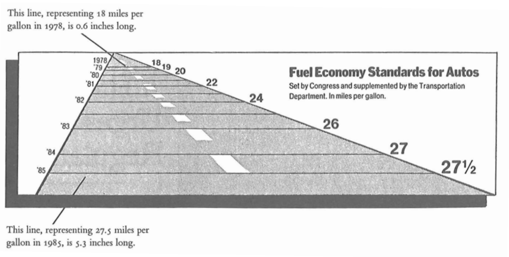

# A bit of theory...

## Rational thinking test

-   If 5 machines produce 5 devices in 5 minutes, how long will it take 100 machines to make 100 devices?
-   A patch of water lilies is growing on a pond. Every day the patch doubles in size. If it takes 48 days for the lilies to cover the entire pond, how many days does it take for them to cover half the pond?
-   A baseball bat and a ball cost $1.10 together. The bat costs one dollar more than the ball. How much does the ball cost?

## Data analysis

Data analysis is the process of examining, cleaning, transforming, and modeling data in order to discover useful information, draw conclusions, and support decision-making. It is a multi-stage process that includes:

- Collecting data from various sources
- Cleaning data by removing errors, missing values, and inconsistencies
- Exploring data to understand its structure and characteristics
- Transforming data into the appropriate format
- Applying statistical methods and machine learning algorithms
- Interpreting results in the context of a specific business or scientific problem

Data analysis is used in nearly every field, from business and finance to social sciences, medicine, and scientific research. The goal of data analysis is to transform raw data into knowledge that can be used to make better decisions.

## Data visualization

Data visualization is the graphical representation of information and data. It uses visual elements such as charts, maps, and dashboards to present relationships between data in a way that is easy to understand and interpret. Good data visualization:

- Presents complex information in an accessible and intuitive way
- Reveals patterns, trends, and outliers that may be difficult to notice in raw data
- Supports the data analysis process by enabling quick review of large datasets
- Facilitates communication of analysis results to various audiences, including non-technical individuals
- Helps tell stories contained in data (data storytelling)

The most popular types of data visualization include bar charts, line charts, pie charts, heatmaps, hierarchical trees, word clouds, and interactive dashboards. The choice of the appropriate visualization form depends on the type of data, the purpose of the presentation, and the target audience.

Data visualization is a key element of the data analysis process because it allows for quick drawing of conclusions and making decisions based on data. It is a bridge between complex data and human understanding.

## Data analysis - basic concepts

### Modern meanings of the word "statistics":

-   a set of numerical data showing the development of processes and phenomena, e.g. population statistics.
-   all activities related to collecting and processing numerical data, e.g. statistics on a certain problem conducted by the Central Statistical Office.
-   numerical characteristics, e.g. sample statistics such as arithmetic mean, standard deviation, etc.
-   a scientific discipline - the science of methods for studying mass phenomena.

### "Massiveness"

Mass phenomena/processes - a large number of units are subject to study. They are divided into:

-   economic (e.g. production, consumption, services, advertising),
-   social (e.g. traffic accidents, political views),
-   demographic (e.g. births, aging, migrations).

### Division of statistics

Statistics - a scientific discipline - division:

-   descriptive statistics - deals with matters related to collecting, presenting, analyzing, and interpreting numerical data. Observation covers the entire population under study.
-   mathematical statistics - generalization of the results of studying a part of the population (sample) to the entire population.

### Population

Statistical population: a set of objects subject to statistical study. It consists of units that are similar to each other, logically related, but not identical. They share certain common features and certain properties that allow them to be differentiated.

-   examples:
    -   study of the height of Polish citizens - inhabitants of Poland
    -   level of education in schools of the Warmian-Masurian Voivodeship - schools of the Warmian-Masurian Voivodeship.
-   division:
    -   general population - covers the entirety,
    -   sample population (sample) - covers a part of the population.

### Statistical unit

Statistical unit: each element of a statistical population.

-   examples:
    -   UWM students - a UWM student
    -   inhabitants of Poland - every person living in Poland
    -   machines produced in a factory - every machine

### Statistical features

Statistical features

-   properties characterizing statistical units in a given statistical population.
-   they are divided into constant and variable.

Constant features

-   properties that are common to all units of a given statistical population.
-   division:
    -   substantive - who or what is the subject of the statistical study,
    -   temporal - when the study was conducted or what time period the study covers,
    -   spatial - what territory (place or area) the study concerns.
-   example: students of the Faculty of Mathematics and Computer Science (WMiI) at UWM in Olsztyn in the academic year 2017/2018:
    -   substantive feature: possession of a student ID card,
    -   temporal feature - students studying in the academic year 2017/2018,
    -   spatial feature - location: WMiI UWM in Olsztyn.

Variable features

-   properties that differentiate statistical units in a given population.
-   example: UWM students - variable features: age, sex, type of secondary school completed, eye color, height.

Important:

-   only variable features are subject to observation,
-   a constant feature in one population may be a variable feature in another population.

Example: UWM students have an ID card issued by UWM. Students of all universities in Poland have ID cards issued by different institutions.

**Division of variable features:**

-   measurable (quantitative) features - can be expressed as a number with a specific unit of measurement.
-   non-measurable (qualitative) features - described verbally, representing certain categories.

Example: student population. Measurable features: age, weight, height, number of absences. Non-measurable features: sex, eye color, field of study.

For practical reasons, numerical codes are often assigned to non-measurable features. However, they should not be confused with measurable features. E.g. 1 - primary education, 2 - vocational education, etc.

**Division of measurable features:**

-   continuous - can take any value within a defined interval, e.g. height, age, apartment area.
-   discrete - can take specific (discrete) numerical values without intermediate values, e.g. number of people in a household, number of employees in a given company.

Discrete features usually have integer values, although this is not always required, e.g. the number of full-time positions in a company (including part-time positions).

### Scales

**Measurement scale**

-   a system that allows the results of statistical measurements to be organized in a certain way.
-   division:
    -   nominal scale,
    -   ordinal scale,
    -   interval scale,
    -   ratio scale.

**Nominal scale**

-   a scale in which a statistical unit is classified into a specific category.
-   values in this scale have no ordering.
-   example:

| Religion     | Code |
|--------------|------|
| Christianity | 1    |
| Islam        | 2    |
| Buddhism     | 3    |

**Ordinal scale**

-   values have a clearly defined order, but distances between them are not given,
-   allows elements to be ranked.
-   examples:

| Education  | Code |
|------------|------|
| Primary    | 1    |
| Secondary  | 2    |
| Higher     | 3    |

| Income | Code |
|--------|------|
| Low    | 1    |
| Medium | 2    |
| High   | 3    |

**Interval scale**

-   feature values are expressed through specific numerical values,
-   allows comparison of units (something is larger or smaller),
-   it is not possible to examine ratios (determining how many times a given value is larger or smaller than another).
-   example:

| City      | Temperature in $^{\circ}C$ | Temperature in $^{\circ}F$ |
|-----------|---------------------------|---------------------------|
| Warsaw    | 15                        | 59                        |
| Olsztyn   | 10                        | 50                        |
| Gdańsk    | 5                         | 41                        |
| Szczecin  | 20                        | 68                        |

**Ratio scale**

-   values are expressed through numerical values,
-   it is possible to determine the smaller or larger relationship between values,
-   it is possible to determine the ratio (quotient) between values,
-   an absolute zero exists.
-   example:

| Product | Price in PLN |
|---------|-------------|
| Bread   | 3           |
| Butter  | 8           |
| Pears   | 5           |

## Types of statistical studies {.smaller}

-   complete study - covers all units of the statistical population.
    -   statistical census,
    -   ongoing registration,
    -   statistical reporting.
-   partial studies - only a part of the population is observed. Conducted when a complete study is impractical or impossible.
    -   monographic method,
    -   representative method.

## Stages of a statistical study

-   designing and organizing the study: establishing the purpose, subject, object, scope, source, and duration of the study;
-   statistical observation;
-   processing statistical material: quality control of statistical material, grouping of obtained data, presentation of data results;
-   statistical analysis.

## Analysis of existing data

Analysis of existing data - the process of processing data in order to obtain useful information and conclusions from them. Depending on the type of data and the problems posed, this may involve the use of statistical, exploratory, and other methods.

Using existing data is an example of non-reactive research - methods of studying social behavior that do not influence those behaviors. Such data include: documents, archives, reports, chronicles, censuses, parish records, diaries, memoirs, internet blogs, audio memoirs, oral history archives, and others. (Wikipedia)

Existing data can be classified according to (Makowska ed. 2013):

-   Nature: Quantitative, Qualitative
-   Form: Processed data, Raw data
-   Method of creation: Primary, Secondary
-   Dynamics: Continuous event registration, Registration at time intervals, One-time registration
-   Level of objectivity: Objective, Subjective
-   Source of origin: Public data, Private data

Data analysis is a process of inspecting, organizing, transforming, and modeling data in order to obtain useful information, draw conclusions, and support the decision-making process. Data analysis has many aspects and approaches, encompassing various techniques under different names, in different business, scientific, and social domains. A practical approach to defining data is that data are numbers, characters, images, or other recording methods, in a form that can be evaluated to determine or make a decision about a specific action. Many people believe that data in itself has no meaning - only processed and interpreted data becomes information.

## Data analysis process

Analysis refers to breaking down the entirety of information into its distinct components for individual examination. Data analysis is the process of obtaining raw data and transforming it into information useful for decision-making by users. Data is collected and analyzed to answer questions, test hypotheses, or disprove theories. There are several phases that can be distinguished in the data analysis process. The phases are iterative, as feedback from subsequent phases may cause additional work in earlier phases.

### Defining requirements {.smaller}

Before proceeding with data analysis, the quality requirements for data must be precisely defined. The input data to be analyzed are determined based on the requirements of those directing the analysis or clients (who will use the final product of the analysis). The general type of entity from which data will be collected is referred to as the experimental unit (e.g. a person or a population of people). Data can be numerical or categorical (i.e. text labels). The requirements definition phase should answer 2 fundamental questions:

-   what do we want to measure?
-   how do we want to measure it?

### Data collection

Data is collected from various sources. Requirements regarding the type and quality of data may be communicated by analysts to "data custodians," such as information technology staff within an organization. Data may also be collected automatically from various types of sensors in the environment - such as traffic cameras, satellites, and devices recording images, sound, and physical parameters. Another method is obtaining data through interviews, gathering from online sources, or directly from documentation.

### Data processing {.smaller}

Collected data must be processed or organized in a logical manner for analysis. For example, they may be placed in tables for further analysis - in a spreadsheet or other software. Data cleaning: After the processing and organizing phase, data may be incomplete, contain duplicates, or contain errors. The need for data cleaning arises from problems related to data entry and storage. Data cleaning is the process of preventing and correcting detected errors. Common tasks include record matching, identifying inaccuracies, overall review of existing data quality, removing duplicates, and column segmentation. It is also extremely important to pay attention to data whose values are above or below previously established thresholds (extremes).

### Proper data analysis {.smaller}

There are several methods that can be used for this purpose, for example data mining, business intelligence, data visualization, or exploratory research. The latter method is a way of analyzing datasets to determine their distinct characteristics. In this way, data can be used to test the original hypothesis. Descriptive statistics is another method for analyzing collected information. Data is examined to find its most important features. In descriptive statistics, analysts use several basic tools - the mean or average of a set of numbers can be used. This helps determine the overall trend, although it does not provide great accuracy when assessing the overall picture of collected data. In this phase, modeling and the creation of mathematical formulas also take place - they are applied to identify relationships between variables, such as correlation or causation.

### Reporting and distribution of results

This phase involves determining in what form to communicate results. The analyst may consider various data visualization techniques to clearly and effectively convey the findings of the analysis to the audience. Data visualization uses graphical forms such as charts and tables. Tables are useful for users who can search for specific records, while charts (e.g. bar charts or line charts) provide a quantitative view of the analyzed dataset.

## Where to get data?

::: {.content-visible when-format="html"}

Free data repositories:

-   Local Data Bank of the Central Statistical Office (GUS) - [link](https://bdl.stat.gov.pl/BDL/start)
-   Open Data - [link](https://dane.gov.pl/)
-   World Bank - [link](https://data.worldbank.org/)

Useful websites:

-   <https://www.kaggle.com/>
-   <https://archive.ics.uci.edu/ml/index.php>
-   <https://huggingface.co/datasets>
-   <https://github.com/awesomedata/awesome-public-datasets>

:::

::: {.content-visible when-format="pdf"}
Free data repositories:

-   Local Data Bank of the Central Statistical Office (GUS) - [link](https://bdl.stat.gov.pl/BDL/start)
-   Open Data - [link](https://dane.gov.pl/)
-   World Bank - [link](https://data.worldbank.org/)

:::

## "Tidy data" concept

::: {.content-visible when-format="html"}

The tidy data concept:

-   WICKHAM, Hadley . Tidy Data. Journal of Statistical Software, \[S.l.\], v. 59, Issue 10, p. 1 - 23, sep. 2014. ISSN 1548-7660. Available at: <https://www.jstatsoft.org/v059/i10>. Date accessed: 25 oct. 2018. doi:http://dx.doi.org/10.18637/jss.v059.i10.

:::

::: {.content-visible when-format="pdf"}

The tidy data concept:

-   WICKHAM, Hadley . Tidy Data. Journal of Statistical Software, \[S.l.\], v. 59, Issue 10, p. 1 - 23, sep. 2014. ISSN 1548-7660. Date accessed: 25 oct. 2018. doi:http://dx.doi.org/10.18637/jss.v059.i10.

:::

### "Tidy data" principles {.smaller}

Ideal data is presented in a table:

| Name   | Age | Height | Eye color |
|--------|-----|--------|-----------|
| Adam   | 26  | 167    | Brown     |
| Sylwia | 34  | 164    | Hazel     |
| Tomasz | 42  | 183    | Blue      |

What should we pay attention to?

-   one observation (statistical unit) = one row in the table/matrix/data frame
-   values of a given feature are found in columns
-   one type/kind of observation in one table/matrix/data frame

### Examples of untidy data

| Name   | Age | Height | Brown | Blue | Hazel |
|--------|-----|--------|-------|------|-------|
| Adam   | 26  | 167    | 1     | 0    | 0     |
| Sylwia | 34  | 164    | 0     | 0    | 1     |
| Tomasz | 42  | 183    | 0     | 1    | 0     |

**Column headers must correspond to features, not to variable values.**

::: {.content-visible when-format="html"}

### Long or wide data?

<https://seaborn.pydata.org/tutorial/data_structure.html#long-form-vs-wide-form-data>

:::

## A few tips for good presentations

::: {.content-visible when-format="html"}

Edward Tufte, professor at Yale, <https://www.edwardtufte.com/>

:::

::: {.content-visible when-format="pdf"}

Edward Tufte, professor at Yale

:::

1.  Present data richly.

2.  Do not hide data, show the truth.

3.  Do not use junk charts.

4.  Show the variability of data, do not design it.

5.  A chart should have the lowest possible lie factor.

6.  PowerPoint is evil!

### Lie factor

::: {.content-visible when-format="html"}

<https://www.facebook.com/janinadaily/photos/a.1524649467770881/2836063543296127/?paipv=0&eav=AfbVIDx5un8ZOklKI9c-B1jP4nOoNa2QMmJmjoA-291JNNgM1L_NmoCGMS_mJOy4xjo&_rdr>

-   the ratio of the effect visible on the chart to the effect indicated by the data on which the chart was drawn.

<https://infovis-wiki.net/wiki/Lie_Factor>

:::

::: {.content-visible when-format="pdf"}

-   the ratio of the effect visible on the chart to the effect indicated by the data on which the chart was drawn.

:::

### Lie factor

\[Tufte, 1991\] Edward Tufte, The Visual Display of Quantitative Information, Second Edition, Graphics Press, USA, 1991, p. 57 -- 69.

$$\operatorname{LieFactor} = \frac{\text{size of the effect visible on the chart}}{\text{size of the effect resulting from the data}}$$

$$\text{effect size} = \frac{|\text{second value}-\text{first value}|}{\text{first value}}$$

$$\operatorname{LieFactor} = \frac{\frac{5.3-0.6}{0.6}}{\frac{27.5-18}{18}} \approx 14.8$$

::: {.content-visible when-format="html"}

## How to create?

-   <https://bookdown.org/rudolf_von_ems/jak_sie_nie_dac/stats_graphs.html>
-   <https://www.data-to-viz.com/>
-   <https://100.datavizproject.com/>

## References {.smaller}

-   <https://pl.wikipedia.org/wiki/Wizualizacja>
-   <https://mfiles.pl/pl/index.php/Analiza_danych>, accessed online 1.04.2019.
-   Walesiak M., Gatnar E., Statystyczna analiza danych z wykorzystaniem programu R, PWN, Warszawa, 2009.
-   Wasilewska E., Statystyka opisowa od podstaw, Podręcznik z zadaniami, Wydawnictwo SGGW, Warszawa, 2009.
-   <https://en.wikipedia.org/wiki/Cognitive_reflection_test>, accessed online 20.03.2023.
-   <https://qlikblog.pl/edward-tufte-dobre-praktyki-prezentacji-danych/>, accessed online 20.03.2023.

:::

::: {.content-visible when-format="pdf"}
## References {.smaller}

-   https://pl.wikipedia.org/wiki/Wizualizacja
-   https://mfiles.pl/pl/index.php/Analiza_danych, accessed online 1.04.2019.
-   Walesiak M., Gatnar E., Statystyczna analiza danych z wykorzystaniem programu R, PWN, Warszawa, 2009.
-   Wasilewska E., Statystyka opisowa od podstaw, Podręcznik z zadaniami, Wydawnictwo SGGW, Warszawa, 2009.
-   https://en.wikipedia.org/wiki/Cognitive_reflection_test, accessed online 20.03.2023.
-   https://qlikblog.pl/edward-tufte-dobre-praktyki-prezentacji-danych/, accessed online 20.03.2023.
:::
