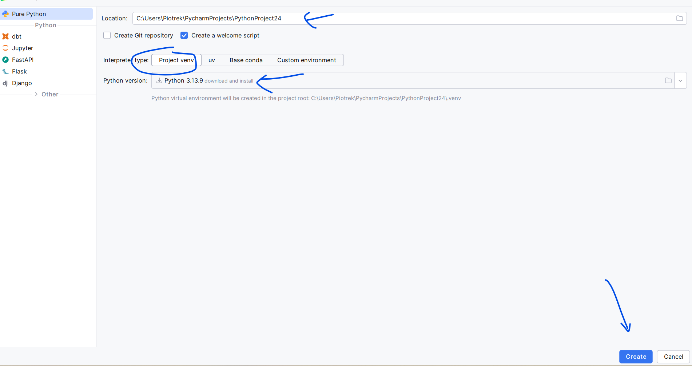

# Configuration

1. In the first step, we create a new project in the chosen location. We select venv and one of the Python versions, e.g. 3.13. Finally, click the Create button.

2. We add the requirements file https://piojas.pl/wp-content/uploads/2026/02/requirements.txt to the project's root directory. The file name is important.

3. We open the terminal in PyCharm and type the command: `pip install -r requirements.txt`

