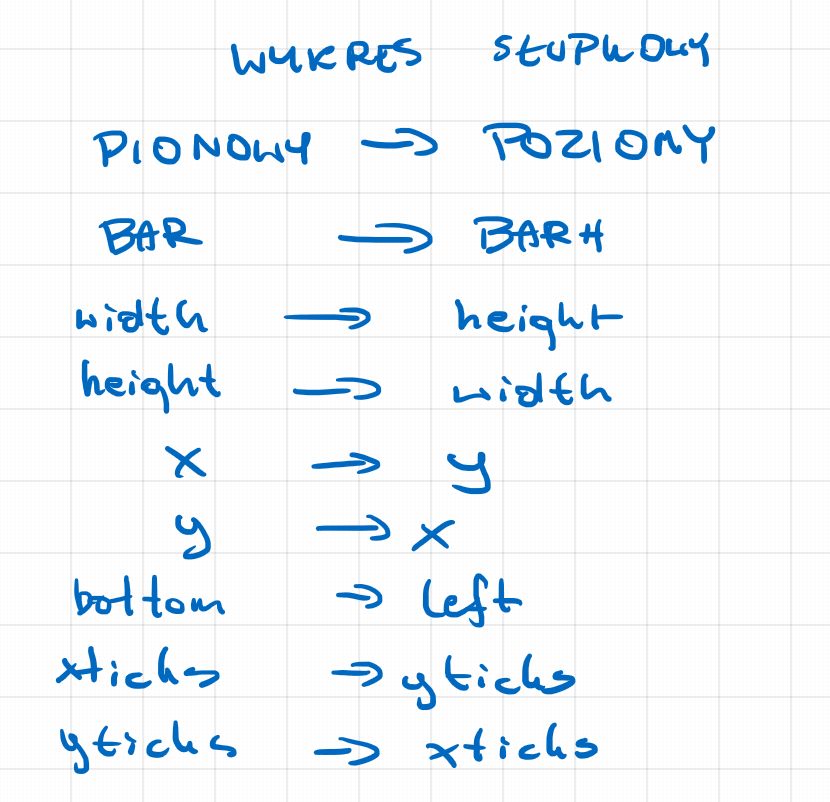

# Matplotlib - bar chart

A bar chart is used to present categorical or discrete data. It is a commonly used type of chart that helps to visually compare values or quantities for different categories. Here are a few types of data for which a bar chart can be used:

1. Frequencies: A bar chart is used to present the number of occurrences of different categories, such as survey results, consumer preferences, or different population groups.
2. Proportions: It can be used to present the percentage share of individual categories in the whole, e.g. the market share of different companies, percentage test results, or the percentage distribution of the population by age.
3. Numeric values: A bar chart can present numeric values associated with different categories, e.g. product sales, revenue from different sources, or the average temperature in different cities.
4. Time series data: A bar chart can also be used to present time series data when changes occur at regular time intervals, e.g. annual sales, monthly rainfall, or weekly revenue.

It is worth noting that bar charts are appropriate when dealing with a small number of categories, because too many bars on a chart can make it difficult to interpret. In such cases, it is worth considering other types of charts, such as a pie chart or a proportional chart.

The `bar` function in the Matplotlib library is used to create bar charts. Bar charts are often used when we want to compare values of different categories. 

The function syntax is `plt.bar(x, height, width=0.8, bottom=None, align='center', data=None, **kwargs)`, where:

- `x` - positions of the bars on the X axis. This can be a sequence of numeric values or a list of labels that will be placed on the X axis.
- `height` - the height of the bars.
- `width` - the width of the bars.
- `bottom` - the position of the bottom edge of the bars. Set to `None` by default, which means the bars start from zero.
- `align` - how the bars are centered along the X axis. Set to 'center' by default.
- `data` - a DataFrame object that contains the data for the chart.
- `**kwargs` - additional arguments for chart formatting, such as color, transparency, axis labels, title, and legend.


```{python}
#| echo: true
import matplotlib.pyplot as plt  #<1>

categories = ['Category 1', 'Category 2', 'Category 3']  #<2>
values = [10, 20, 15]  #<3>

plt.bar(categories, values, color='green', alpha=0.5)  #<4>

plt.title('Bar chart')  #<5>
plt.xlabel('Categories')  #<6>
plt.ylabel('Values')  #<7>

plt.show()  #<8>
```

1. `import matplotlib.pyplot as plt`: imports the matplotlib.pyplot library as `plt`, which is needed to create charts.
2. `categories = ['Category 1', 'Category 2', 'Category 3']`: creates a list `categories` containing the names of three categories that will be used on the X axis of the bar chart.
3. `values = [10, 20, 15]`: creates a list `values` containing the numeric values corresponding to each category - these values determine the height of the individual bars.
4. `plt.bar(categories, values, color='green', alpha=0.5)`: creates a bar chart, where:
   - the first argument is the categories (X axis)
   - the second argument is the values (the height of the bars)
   - the `color='green'` parameter sets the color of the bars to green
   - the `alpha=0.5` parameter sets the transparency of the bars to 50%
5. `plt.title('Bar chart')`: gives the chart the title "Bar chart".
6. `plt.xlabel('Categories')`: adds an X axis label with the text "Categories".
7. `plt.ylabel('Values')`: adds a Y axis label with the text "Values".
8. `plt.show()`: displays the prepared chart.

```{python}
#| echo: true
import matplotlib.pyplot as plt

categories = ['Category 1', 'Category 2', 'Category 3']
values = [10, 20, 15]
fig, ax = plt.subplots()
ax.bar(categories, values, color='green', alpha=0.5)
ax.set_title('Bar chart')
ax.set_xlabel('Categories')
ax.set_ylabel('Values')
plt.show()
```

```{python}
#| echo: true
import numpy as np
import matplotlib.pyplot as plt
import pandas as pd

sales_data = {
    'product': ['Smartphone', 'Tablet', 'Laptop', 'Headphones', 'Smartwatch'],
    'units_sold': [156, 89, 234, 312, 178],
    'category': ['phones', 'tablets', 'computers', 'accessories', 'watch']
}

df = pd.DataFrame(sales_data)

y_pos = np.arange(len(df))

colors = {'phones': 'blue', 'tablets': 'red', 'computers': 'green', 
          'accessories': 'purple', 'watch': 'orange'}

colors_list = [colors[cat] for cat in df['category']]

plt.bar(y_pos, df['units_sold'], color=colors_list, alpha=0.8)
plt.xticks(y_pos, df['product'], rotation=45, ha='right')
plt.xlabel('Products')
plt.ylabel('Number of units sold')
plt.title('Sales of electronic products in the last month')
plt.grid(axis='y', alpha=0.3)
plt.tight_layout()
plt.show()

```

```{python}
#| echo: true
import numpy as np
import matplotlib.pyplot as plt
import pandas as pd
sales_data = {
    'product': ['Smartphone', 'Tablet', 'Laptop', 'Headphones', 'Smartwatch'],
    'units_sold': [156, 89, 234, 312, 178],
    'category': ['phones', 'tablets', 'computers', 'accessories', 'watch']
}
df = pd.DataFrame(sales_data)
y_pos = np.arange(len(df))
colors = {'phones': 'blue', 'tablets': 'red', 'computers': 'green', 
          'accessories': 'purple', 'watch': 'orange'}
colors_list = [colors[cat] for cat in df['category']]
fig, ax = plt.subplots()
ax.bar(y_pos, df['units_sold'], color=colors_list, alpha=0.8)
ax.set_xticks(y_pos)
ax.set_xticklabels(df['product'], rotation=45, ha='right')
ax.set_xlabel('Products')
ax.set_ylabel('Number of units sold')
ax.set_title('Sales of electronic products in the last month')
ax.grid(axis='y', alpha=0.3)
fig.tight_layout()
plt.show()
```


```{python}
#| echo: true
import numpy as np  #<1>
import matplotlib.pyplot as plt  #<2>
import pandas as pd  #<3>

df = pd.DataFrame({  #<4>
    'Quarter': ['Q1', 'Q2', 'Q3', 'Q4'],
    'Phones': [30, 25, 50, 20],
    'Laptops': [40, 23, 51, 17],
    'Tablets': [35, 22, 45, 19]
})

phones = df['Phones']  #<5>
laptops = df['Laptops']  #<6>
tablets = df['Tablets']  #<7>
quarters = df['Quarter']  #<8>
X = np.arange(len(quarters))  #<9>
plt.bar(X - 0.25, phones, color='dodgerblue', width=0.25, label='Phones')  #<10>
plt.bar(X, laptops, color='mediumseagreen', width=0.25, label='Laptops')  #<11>
plt.bar(X + 0.25, tablets, color='tomato', width=0.25, label='Tablets')  #<12>
plt.xticks(X, quarters)  #<13>
plt.legend()  #<14>
plt.title('Sales of electronic products in individual quarters', fontsize=14)  #<15>
plt.ylabel('Number of units sold')  #<16>
plt.xlabel('Quarter')  #<17>
plt.grid(axis='y', alpha=0.3)  #<18>
plt.tight_layout()  #<19>
plt.show()  #<20>
```

1. `import numpy as np`: imports the NumPy library for numerical operations and assigns it the alias `np`.
2. `import matplotlib.pyplot as plt`: imports the pyplot module from the Matplotlib library for creating charts and assigns it the alias `plt`.
3. `import pandas as pd`: imports the Pandas library for working with data and assigns it the alias `pd`.
4. `df = pd.DataFrame({...})`: creates a DataFrame with data on the sales of electronic products in individual quarters.
5. `phones = df['Phones']`: extracts the 'Phones' column from the DataFrame and assigns it to the variable `phones`.
6. `laptops = df['Laptops']`: extracts the 'Laptops' column from the DataFrame and assigns it to the variable `laptops`.
7. `tablets = df['Tablets']`: extracts the 'Tablets' column from the DataFrame and assigns it to the variable `tablets`.
8. `quarters = df['Quarter']`: extracts the 'Quarter' column from the DataFrame and assigns it to the variable `quarters`.
9. `X = np.arange(len(quarters))`: creates an array of indices from 0 to the length of the quarters list (0, 1, 2, 3), which will be used to position the bars.
10. `plt.bar(X - 0.25, phones, color='dodgerblue', width=0.25, label='Phones')`: draws the bars for phones shifted to the left (-0.25), in blue and with a width of 0.25.
11. `plt.bar(X, laptops, color='mediumseagreen', width=0.25, label='Laptops')`: draws the bars for laptops in the center (no shift), in green and with a width of 0.25.
12. `plt.bar(X + 0.25, tablets, color='tomato', width=0.25, label='Tablets')`: draws the bars for tablets shifted to the right (+0.25), in red and with a width of 0.25.
13. `plt.xticks(X, quarters)`: sets the X axis labels to the names of the quarters (Q1, Q2, Q3, Q4) at the positions defined by the array X.
14. `plt.legend()`: adds a legend to the chart that shows the colors and names of the individual product categories.
15. `plt.title('Sales of electronic products in individual quarters', fontsize=14)`: sets the chart title with a font size of 14.
16. `plt.ylabel('Number of units sold')`: adds a Y axis label describing what the values on the vertical axis represent.
17. `plt.xlabel('Quarter')`: adds an X axis label describing what the values on the horizontal axis represent.
18. `plt.grid(axis='y', alpha=0.3)`: adds horizontal grid lines (only on the Y axis) with a transparency of 0.3.
19. `plt.tight_layout()`: automatically adjusts the chart margins so that all elements are clearly visible and do not overlap.
20. `plt.show()`: displays the chart 

```{python}
#| echo: true
import numpy as np
import matplotlib.pyplot as plt
import pandas as pd
df = pd.DataFrame({
    'Quarter': ['Q1', 'Q2', 'Q3', 'Q4'],
    'Phones': [30, 25, 50, 20],
    'Laptops': [40, 23, 51, 17],
    'Tablets': [35, 22, 45, 19]
})
phones = df['Phones']
laptops = df['Laptops']
tablets = df['Tablets']
quarters = df['Quarter']
X = np.arange(len(quarters))
fig, ax = plt.subplots()
ax.bar(X - 0.25, phones, color='dodgerblue', width=0.25, label='Phones')
ax.bar(X, laptops, color='mediumseagreen', width=0.25, label='Laptops')
ax.bar(X + 0.25, tablets, color='tomato', width=0.25, label='Tablets')
ax.set_xticks(X)
ax.set_xticklabels(quarters)
ax.legend()
ax.set_title('Sales of electronic products in individual quarters', fontsize=14)
ax.set_ylabel('Number of units sold')
ax.set_xlabel('Quarter')
ax.grid(axis='y', alpha=0.3)
fig.tight_layout()
plt.show()
```


```{python}
#| echo: true
import numpy as np  #<1>
import matplotlib.pyplot as plt  #<2>

N = 5  #<3>

boys = (20, 35, 30, 35, 27)  #<4>
girls = (25, 32, 34, 20, 25)  #<5>
ind = np.arange(N)  #<6>
width = 0.35  #<7>

plt.bar(ind, boys, width, label="boys")  #<8>
plt.bar(ind, girls, width, bottom=boys, label="girls")  #<9>

plt.ylabel('Contribution')  #<10>
plt.title('Contribution by the teams')  #<11>
plt.xticks(ind, ('T1', 'T2', 'T3', 'T4', 'T5'))  #<12>
plt.yticks(np.arange(0, 81, 10))  #<13>
plt.legend()  #<14>
plt.show()  #<15>
```

1. `import numpy as np`: imports the NumPy library for numerical operations and assigns it the alias `np`.
2. `import matplotlib.pyplot as plt`: imports the pyplot module from the Matplotlib library for creating charts and assigns it the alias `plt`.
3. `N = 5`: defines a constant N equal to 5, which represents the number of teams/data groups.
4. `boys = (20, 35, 30, 35, 27)`: creates a tuple containing the contribution values of the boys for each of the 5 teams.
5. `girls = (25, 32, 34, 20, 25)`: creates a tuple containing the contribution values of the girls for each of the 5 teams.
6. `ind = np.arange(N)`: creates an array of indices [0, 1, 2, 3, 4], which defines the positions of the bars on the X axis.
7. `width = 0.35`: sets the width of the bars to 0.35 units.
8. `plt.bar(ind, boys, width, label="boys")`: draws the bars for the boys at the positions defined by `ind`, with heights from `boys`, a width of `width` and the label "boys".
9. `plt.bar(ind, girls, width, bottom=boys, label="girls")`: draws the bars for the girls at the same positions, but using the `bottom=boys` parameter, which places the girls' bars on top of the boys' bars, creating a stacked bar chart.
10. `plt.ylabel('Contribution')`: adds a Y axis label describing that the values represent contribution.
11. `plt.title('Contribution by the teams')`: gives the chart the title "Contribution by the teams".
12. `plt.xticks(ind, ('T1', 'T2', 'T3', 'T4', 'T5'))`: sets the X axis labels to the team names (T1, T2, T3, T4, T5) at the positions defined by the array `ind`.
13. `plt.yticks(np.arange(0, 81, 10))`: sets the ticks on the Y axis every 10 units, from 0 to 80.
14. `plt.legend()`: adds a legend to the chart that shows the colors and labels for the boys and girls.
15. `plt.show()`: displays the chart 


```{python}
#| echo: true
import numpy as np
import matplotlib.pyplot as plt
N = 5
boys = (20, 35, 30, 35, 27)
girls = (25, 32, 34, 20, 25)
ind = np.arange(N)
width = 0.35
fig, ax = plt.subplots()
ax.bar(ind, boys, width, label="boys")
ax.bar(ind, girls, width, bottom=boys, label="girls")
ax.set_ylabel('Contribution')
ax.set_title('Contribution by the teams')
ax.set_xticks(ind)
ax.set_xticklabels(('T1', 'T2', 'T3', 'T4', 'T5'))
ax.set_yticks(np.arange(0, 81, 10))
ax.legend()
plt.show()
```



The `barh` function is used to create horizontal bar charts. Horizontal bar charts are often used when we want to compare values of different categories and the labels on the X axis are long or very numerous. 

The function syntax is `plt.barh(y, width, height=0.8, left=None, align='center', data=None, **kwargs)`, where:

- `y` - positions of the bars on the Y axis. This can be a sequence of numeric values or a list of labels that will be placed on the Y axis.
- `width` - the width of the bars.
- `height` - the height of the bars.
- `left` - the position of the left edge of the bars. Set to `None` by default, which means the bars start from zero.
- `align` - how the bars are centered along the Y axis. Set to 'center' by default.
- `data` - a DataFrame object that contains the data for the chart.
- `**kwargs` - additional arguments for chart formatting, such as color, transparency, axis labels, title, and legend.

```{python}
#| echo: true
import matplotlib.pyplot as plt

# Data
categories = ['Category 1', 'Category 2', 'Category 3']
values = [10, 20, 15]

# Creating a horizontal bar chart
plt.barh(categories, values, color='green', alpha=0.5)

# Adding a title and axis labels
plt.title('Horizontal bar chart')
plt.xlabel('Values')
plt.ylabel('Categories')

# Displaying the chart
plt.show()

```


```{python}
#| echo: true
import numpy as np
import matplotlib.pyplot as plt
import pandas as pd
sales_data = {
    'product': ['Smartphone', 'Tablet', 'Laptop', 'Headphones', 'Smartwatch'],
    'units_sold': [156, 89, 234, 312, 178],
    'category': ['phones', 'tablets', 'computers', 'accessories', 'watch']
}
df = pd.DataFrame(sales_data)
y_pos = np.arange(len(df))
colors = {'phones': 'blue', 'tablets': 'red', 'computers': 'green', 
          'accessories': 'purple', 'watch': 'orange'}
colors_list = [colors[cat] for cat in df['category']]
plt.barh(y_pos, df['units_sold'], color=colors_list, alpha=0.8)
plt.yticks(y_pos, df['product'])
plt.ylabel('Products')
plt.xlabel('Number of units sold')
plt.title('Sales of electronic products in the last month')
plt.grid(axis='x', alpha=0.3)
plt.tight_layout()
plt.show()

```

```{python}
#| echo: true

import numpy as np
import matplotlib.pyplot as plt
import pandas as pd

df = pd.DataFrame({
    'Quarter': ['Q1', 'Q2', 'Q3', 'Q4'],
    'Phones': [30, 25, 50, 20],
    'Laptops': [40, 23, 51, 17],
    'Tablets': [35, 22, 45, 19]
})

phones = df['Phones']
laptops = df['Laptops']
tablets = df['Tablets']
quarters = df['Quarter']
Y = np.arange(len(quarters))
plt.barh(Y, phones, color='dodgerblue', height=0.25, label='Phones')
plt.barh(Y + 0.25, laptops, color='mediumseagreen', height=0.25, label='Laptops')
plt.barh(Y + 0.50, tablets, color='tomato', height=0.25, label='Tablets')
plt.yticks(Y + 0.25, quarters)
plt.legend()
plt.title('Sales of electronic products in individual quarters', fontsize=14)
plt.xlabel('Number of units sold')
plt.ylabel('Quarter')
plt.grid(axis='x', alpha=0.3)
plt.tight_layout()
plt.show()
```

```{python}
#| echo: true
import numpy as np
import matplotlib.pyplot as plt

N = 5

boys = (20, 35, 30, 35, 27)
girls = (25, 32, 34, 20, 25)
ind = np.arange(N)
height = 0.35

plt.barh(ind, boys, height, label="boys")
plt.barh(ind, girls, height, left=boys, label="girls")

plt.xlabel('Contribution')
plt.title('Contribution by the teams')
plt.yticks(ind, ('T1', 'T2', 'T3', 'T4', 'T5'))
plt.xticks(np.arange(0, 81, 10))
plt.legend()
plt.show()

```
