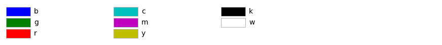
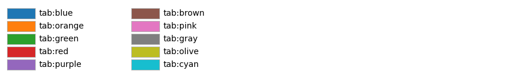
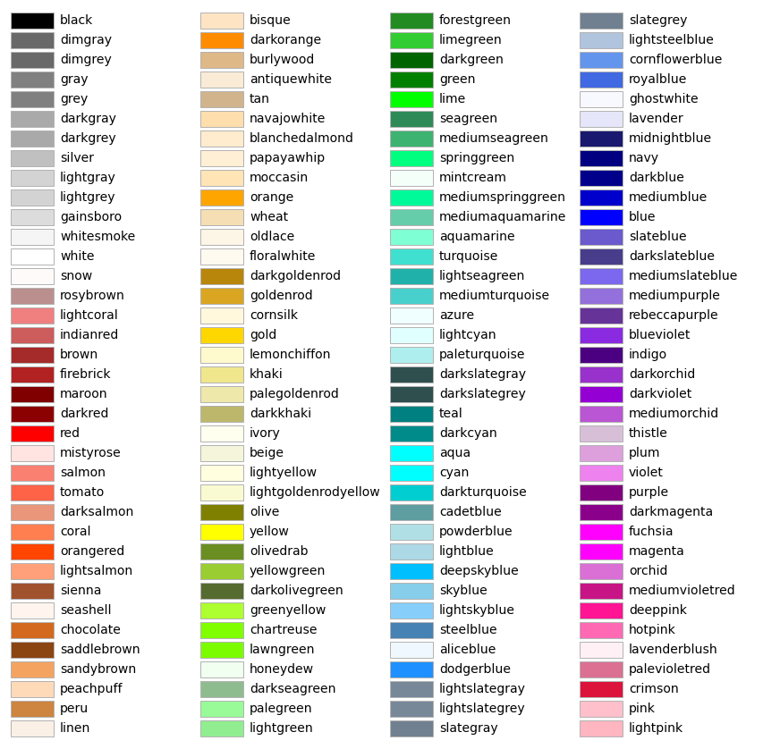
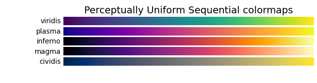
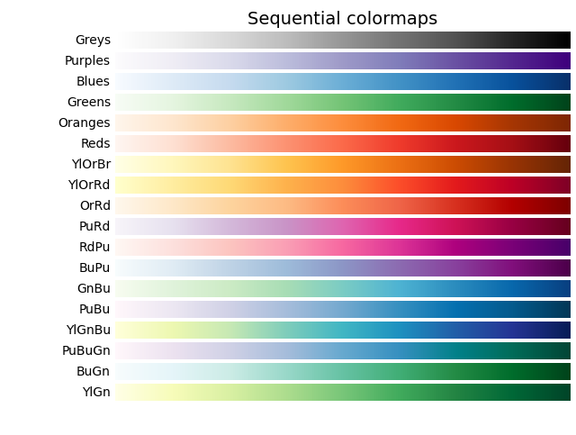
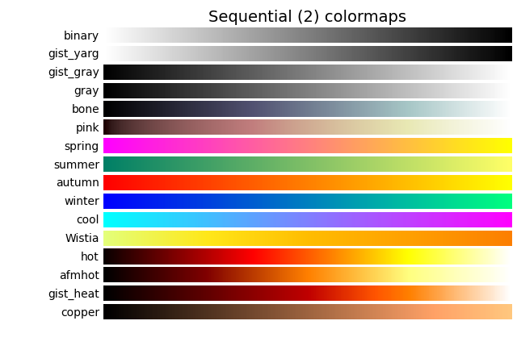
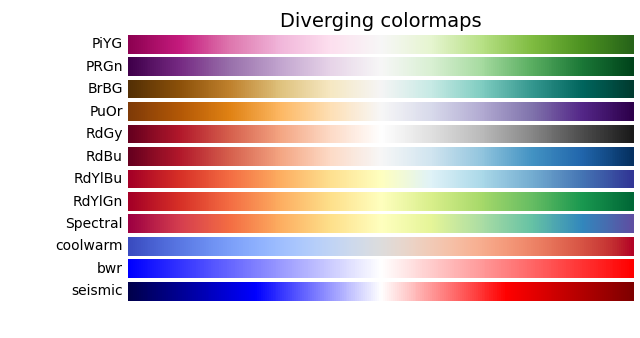
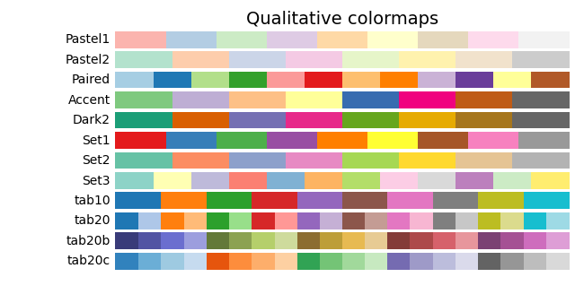
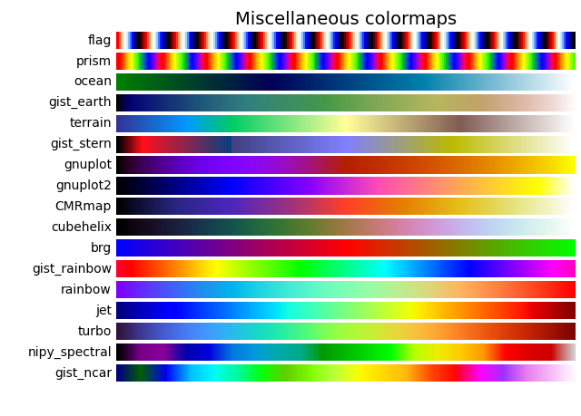

# Matplotlib - colors

* <https://matplotlib.org/stable/gallery/color/named_colors.html>
* <https://pl.wikipedia.org/wiki/Lista_kolor%C3%B3w>







```{python}
#| echo: true
import numpy as np
import matplotlib.pyplot as plt

x = np.random.rand(50)
y = np.random.rand(50)
z = np.random.rand(50)
plt.scatter(x, y, c=z, cmap='viridis')  # <1>
plt.colorbar()  # <2>
plt.xlabel('X axis')
plt.ylabel('Y axis')
plt.title('Color map for a scatter plot')
plt.show(block=True)

```


1. `plt.scatter(x, y, c=z, cmap='viridis')`: this line creates a scatter plot with the data `x`, `y` and `z`. `x` and `y` are the data that will be displayed on the X and Y axes, while `z` is the data that will be used to create the color map. The `cmap='viridis'` argument specifies the color map that will be used to assign colors to the numeric values.
2. `plt.colorbar()`: this line adds a colorbar to the scatter plot. The colorbar indicates which colors correspond to the numeric values on the color map.

Color maps

A list of built-in color maps: <https://matplotlib.org/stable/tutorials/colors/colormaps.html>














```{python}
#| echo: true
import numpy as np
import matplotlib.pyplot as plt
from matplotlib.colors import Normalize

# Example data
x = np.random.rand(50)
y = np.random.rand(50)
z = np.random.rand(50) * 100

# Creating the color map
norm = Normalize(vmin=0, vmax=100)
cmap = plt.cm.viridis

# Creating a scatter plot with a color map
plt.scatter(x, y, c=z, cmap=cmap, norm=norm)
plt.colorbar()

# Adding axis labels
plt.xlabel('X axis')
plt.ylabel('Y axis')
plt.title('Color map for a scatter plot')

# Displaying the chart
plt.show(block=True)


```
