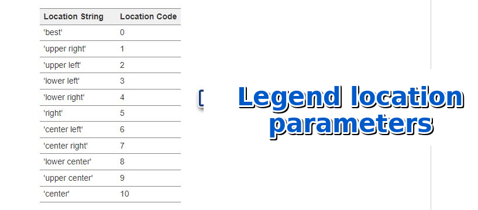
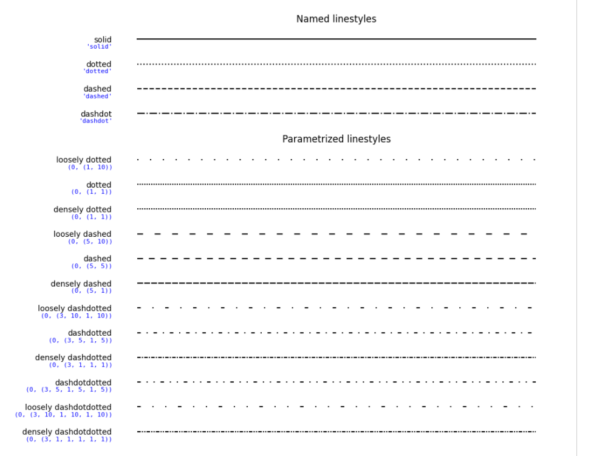

# Matplotlib - extras part 1


## Legend parameters



```{python}
#| echo: true
import matplotlib.pyplot as plt
import numpy as np

x = np.linspace(0, 2, 100)
plt.plot(x, x, label='linear')
plt.plot(x, x ** 2, label='quadratic')
plt.plot(x, x ** 3, label='cubic')
plt.xlabel('x label')
plt.ylabel('y label')
plt.title("Simple Plot")
plt.legend(loc = 5)
plt.show()
```

```{python}
#| echo: true
import matplotlib.pyplot as plt
import numpy as np

# We create the Figure object and the axes (Axes)
fig = plt.figure()
ax = fig.add_subplot(111)  # 111 means: 1 row, 1 column, first chart

# We generate the data
x = np.linspace(0, 2, 100)

# We draw the plots on the axis
ax.plot(x, x, label='linear')
ax.plot(x, x**2, label='quadratic')
ax.plot(x, x**3, label='cubic')

# We add labels and a title
ax.set_xlabel('x label')
ax.set_ylabel('y label')
ax.set_title("Simple Plot")

# We add a legend
ax.legend(loc=5)  # loc=5 means position "right"

# We display the chart
plt.show()
```

## Styles, line colors

```{python}
#| echo: true
import numpy as np
import matplotlib.pyplot as plt

x = np.arange(14)  # <1>
y = np.cos(5 * x)  # <2>
plt.plot(x, y + 2, 'blue', linestyle="-", label="blue")  # <3>
plt.plot(x, y + 1, 'red', linestyle=":", label="red")  # <4>
plt.plot(x, y, 'green', linestyle="--", label="green")  # <5>
plt.legend(title='Legend:')
plt.show()

```

1. `x = np.arange(14)`: creates an array `x` with values from 0 to 13 (inclusive of 13), using the `arange` function from the `numpy` library.
2. `y = np.cos(5 * x)`: calculates the cosine function values for each value of `x`, multiplied by 5. The resulting values are stored in the array `y`.
3. `plt.plot(x, y + 2, 'blue', linestyle="-", label="blue")`: draws a blue chart with values from the array `x`, and the `y` values shifted upward by 2. The line is solid (`linestyle="-"`).
4. `plt.plot(x, y + 1, 'red', linestyle=":", label="red")`: draws a red chart with values from the array `x`, and the `y` values shifted upward by 1. The line is dotted (`linestyle=":"`).
5. `plt.plot(x, y, 'green', linestyle="--", label="green")`: draws a green chart with values from the array `x` and the `y` values. The line is dashed (`linestyle="--"`).





```{python}
#| echo: true
import numpy as np
import matplotlib.pyplot as plt

fig = plt.figure()
ax = fig.add_subplot(111)

x = np.arange(14)
y = np.cos(5 * x)

ax.plot(x, y + 2, 'blue', linestyle="-", label="blue")
ax.plot(x, y + 1, 'red', linestyle=":", label="red")
ax.plot(x, y, 'green', linestyle="--", label="green")

ax.legend(title='Legend:')

plt.show()
```

```{python}
#| echo: true
import matplotlib.pyplot as plt
import numpy as np

months = ['Jan', 'Feb', 'Mar', 'Apr', 'May', 'Jun']
sales = [12500, 14000, 16700, 15400, 18200, 19500]

plt.plot(months, sales, 'bo-', linewidth=2, markersize=8)
plt.grid(True, linestyle='--', alpha=0.7)
plt.title('Sales in the first half of 2025')
plt.xlabel('Month')
plt.ylabel('Sales (PLN)')
plt.ylim([10000, 21000])
plt.fill_between(months, sales, 10000, alpha=0.2, color='skyblue')
plt.axhline(y=15000, color='red', linestyle='--')
plt.text(0, 15300, 'Monthly target', color='red')
plt.tight_layout()
plt.show()
```

```{python}
#| echo: true
import matplotlib.pyplot as plt
import numpy as np

months = ['Jan', 'Feb', 'Mar', 'Apr', 'May', 'Jun']
sales = [12500, 14000, 16700, 15400, 18200, 19500]

fig, ax = plt.subplots()
ax.plot(months, sales, 'bo-', linewidth=2, markersize=8)
ax.grid(True, linestyle='--', alpha=0.7)
ax.set_title('Sales in the first half of 2025')
ax.set_xlabel('Month')
ax.set_ylabel('Sales (PLN)')
ax.set_ylim([10000, 21000])
ax.fill_between(months, sales, 10000, alpha=0.2, color='skyblue')
ax.axhline(y=15000, color='red', linestyle='--')
ax.text(0, 15300, 'Monthly target', color='red')
plt.tight_layout()
plt.show()
```
