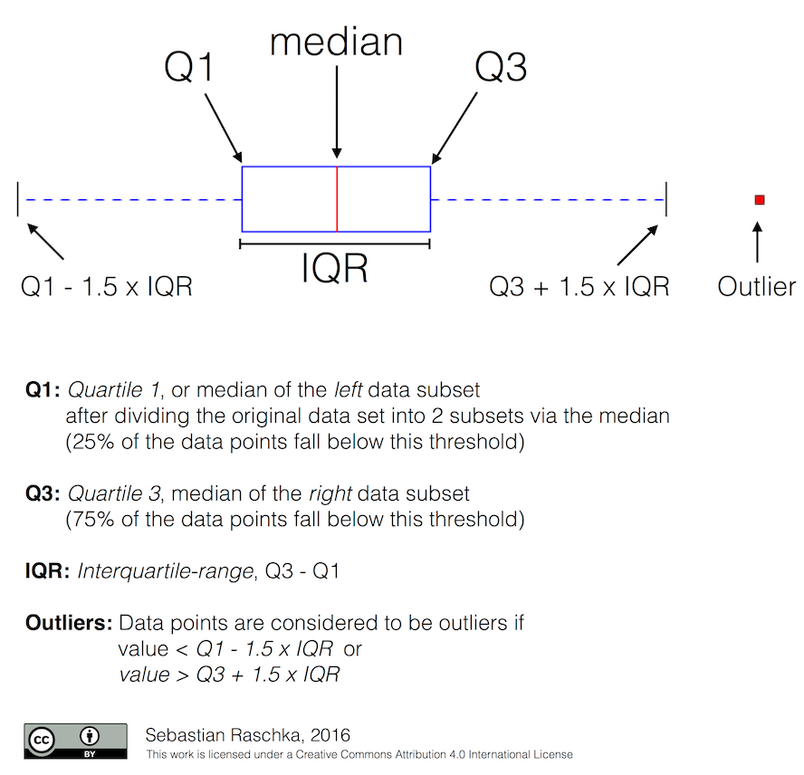

# Matplotlib - other charts


## Dual-axis chart

The `twinx` function in the Matplotlib library allows you to create a second Y axis that will share the X axis with the first Y axis. Thanks to this, you can easily present two data series that are measured in different units but have a common independent variable.

The function syntax is `twinx(ax=None, **kwargs)`, where:

- `ax` - the Axes object to be used to create the new Y axis. Set to `None` by default, which means a new Y axis will be created.
- `**kwargs` - additional arguments for formatting the new Y axis.


```{python}
#| echo: true
import numpy as np
import matplotlib.pyplot as plt

fig, ax1 = plt.subplots()
x = np.arange(0.01, 10.0, 0.01)
y = x ** 2
ax1.plot(x, y, 'r')
ax2 = ax1.twinx()
y2 = np.sin(x)
ax2.plot(x, y2)
fig.tight_layout()
plt.show(block=True)
```

```{python}
#| echo: true
import numpy as np
import matplotlib.pyplot as plt

fig, ax1 = plt.subplots()
t = np.arange(0.01, 10.0, 0.01)
s1 = np.exp(t)
ax1.plot(t, s1, 'b-')
ax1.set_xlabel('time (s)')

ax1.set_ylabel('exp', color='b')
ax1.tick_params('y', colors='b')

ax2 = ax1.twinx()
s2 = np.sin(2 * np.pi * t)
ax2.plot(t, s2, 'r.')
ax2.set_ylabel('sin', color='r')
ax2.tick_params('y', colors='r')

fig.tight_layout()
plt.show(block=True)

```


## Box plot

A box plot is used to present information about the distribution of numeric data and to identify outliers. It is particularly useful when analyzing continuous data that have different values and distributions. Here are a few types of data for which a box plot can be used:

1. Comparing groups: A box plot is used to compare the distribution of data between different groups. For example, it can be used to compare the test results of students from different schools, salaries in different sectors, or the sales values of different products.

2. Identifying outliers: A box plot is used to identify outliers in the data, which may indicate measurement errors, unusual observations, or extreme values. For example, it can be used to detect anomalies in meteorological data, stock market values, or medical data.

3. Distribution analysis: A box plot helps to understand the distribution of data, such as the median, quartiles, range of values, and potential outliers. It can be used in the analysis of data such as grades, population growth, stock value, or real estate prices.

4. Visualization of multidimensional data: A box plot can be used to visualize multidimensional data, presenting the distribution of many variables on a single chart. For example, you can compare variables such as age, earnings, and education in a demographic study.

It is worth noting that a box plot is particularly useful when we want to understand the distribution of data, but it does not show the specific number of observations or the values of individual data points. In such cases, other types of charts, such as a scatter plot, may be more appropriate.

A box plot shows five descriptive statistics of the data: the minimum, the first quartile (Q1), the median, the third quartile (Q3), and the maximum.

```{python}
#| echo: true
import matplotlib.pyplot as plt
import numpy as np

# Example data
data = np.random.rand(100)

# Creating the chart
fig, ax = plt.subplots()

# Drawing the boxplot
ax.boxplot(data)

# Adding labels
ax.set_title('Boxplot')
ax.set_ylabel('Values')
ax.set_xticklabels(['Example data'])

# Displaying the chart
plt.show(block=True)

```



```{python}
#| echo: true
import matplotlib.pyplot as plt
import numpy as np

# Creating dataset
np.random.seed(10)
data = np.random.normal(100, 20, 200)

# Creating plot
plt.boxplot(data)

# show plot
plt.show(block=True)

```


 **`    patch_artist=True,    # colored boxes`**
   – enables the use of "Patch" objects to draw the boxes themselves, so that we can fill them with color (further controlled by `boxprops`).

 **`    notch=True,           # notches at the median`**
   – draws a notch around the median line, which helps to visually assess the significance of differences between medians.

 **`    boxprops=dict(facecolor='lightblue', edgecolor='navy'),`**
   – styling of the boxes themselves:

   * `facecolor='lightblue'` – fills the box with a light blue color,
   * `edgecolor='navy'` – outlines the box in dark navy.

 **`    medianprops=dict(color='darkred'),`**
   – properties of the median line: only the dark red color (`darkred`).

 **`    whiskerprops=dict(color='navy'),`**
   – style of the whiskers: the "navy" color for the lines that connect the box with the ends of the data range (without taking outliers into account).

 **`    capprops=dict(color='navy'),`**
   – style of the "caps" at the ends of the whiskers: also the navy color.

 **`    flierprops=dict(`**
    – style of the outlier points ("fliers", values beyond the reach of the whiskers):

    * `marker='o'` – a circle as the marker,
    * `markerfacecolor='gray'` – gray fill of the circle,
    * `markersize=5` – the size of the marker,
    * `linestyle='none'` – no line connecting these points.
    
```{python}
#| echo: true
import pandas as pd
import matplotlib.pyplot as plt

# Preparing the data
data = pd.DataFrame({
    'Mode of transport': [
        'Car', 'Car', 'Car', 'Car', 'Car',
        'Bicycle',    'Bicycle',    'Bicycle',    'Bicycle',    'Bicycle',
        'Public transport', 'Public transport', 'Public transport', 'Public transport', 'Public transport'
    ],
    'Commute time (minutes)': [
        25, 30, 28, 55, 32,
        20, 18, 22, 19, 21,
        40, 45, 42, 38, 44
    ]
})

# Preparing the data for the box plot
groups = data['Mode of transport'].unique()
times_list = [data.loc[data['Mode of transport'] == s, 'Commute time (minutes)']
              for s in groups]

# Drawing the chart
plt.figure(figsize=(8, 6))
plt.boxplot(
    times_list,
    tick_labels=groups,
    patch_artist=True,    # colored boxes
    notch=True,           # notches at the median
    boxprops=dict(facecolor='lightblue', edgecolor='navy'),
    medianprops=dict(color='darkred'),
    whiskerprops=dict(color='navy'),
    capprops=dict(color='navy'),
    flierprops=dict(marker='o', markerfacecolor='gray', markersize=5, linestyle='none')
)

# Axis labels and title
plt.ylabel('Commute time [minutes]', fontsize=12)
plt.title('Comparison of commute times to work\nby mode of transport', fontsize=14)

# Grid and aesthetics
plt.grid(axis='y', linestyle='--', alpha=0.7)
plt.tight_layout()

# Displaying
plt.show()
```

## Histogram

A histogram is used to present the distribution of numeric data, both continuous and discrete. A histogram shows the frequency of occurrence of data in specific intervals (bins), which allows for the analysis of the distribution and the identification of patterns. Here are a few types of data for which a histogram can be used:

1. Distribution analysis: A histogram can be used to analyze the distribution of data, such as grades, prices, stock values, population growth, or meteorological data. This allows you to understand how the data is distributed, whether it is concentrated around certain values, or whether it has a long tail (i.e. whether there are outliers).

2. Identifying trends: A histogram can help identify trends or patterns in data. For example, you can use a histogram to identify seasonal sales patterns, changes in stock market values, or population migration patterns.

3. Comparing groups: A histogram can also be used to compare the distribution of data between different groups. For example, it can be used to compare the test results of students from different schools, salaries in different sectors, or the sales values of different products.

4. Estimating parameters: A histogram can help estimate distribution parameters, such as the mean, median, or variance, which can be useful in statistical analysis.

It is worth noting that a histogram is suitable for numeric data, but it is not intended for presenting categorical data. In such cases, other types of charts, such as a bar chart, may be more appropriate.

```{python}
#| echo: true
import matplotlib.pyplot as plt

x = [1, 1, 2, 3, 3, 5, 7, 8, 9, 10,
     10, 11, 11, 13, 13, 15, 16, 17, 18, 18]

plt.hist(x, bins=4)
plt.show(block=True)

```

```{python}
#| echo: true
import pandas as pd
import matplotlib.pyplot as plt

ages = [20, 22, 25, 27, 21, 23, 37, 31, 61, 45, 41, 32]
bins = [18, 25, 35, 60, 100]
cats2 = pd.cut(ages, [18, 26, 36, 61, 100], right=False)
print(cats2)
group_names = ['Youth', 'YoungAdult',
               'MiddleAged', 'Senior']
data = pd.cut(ages, bins, labels=group_names)
plt.hist(data)
plt.show(block=True)

```

```{python}
#| echo: true
import matplotlib.pyplot as plt

ages = [20, 22, 25, 27, 21, 23, 37, 31, 61, 45, 41, 32]
bins = [18, 25, 35, 60, 100]
plt.hist(ages, bins=bins)
plt.show(block=True)

```

```{python}
#| echo: true
import matplotlib.pyplot as plt

x = [1, 1, 2, 3, 3, 5, 7, 8, 9, 10,
     10, 11, 11, 13, 13, 15, 14, 12, 18, 18]

plt.hist(x, bins=[0, 5, 10, 15, 20])
plt.xticks([0, 5, 10, 15, 20])
plt.show(block=True)

```

```{python}
#| echo: true
import matplotlib.pyplot as plt

x = [1, 1, 2, 3, 3, 5, 7, 8, 9, 10,
     10, 11, 11, 13, 13, 15, 14, 12, 18, 18]

plt.hist(x, bins=[0, 5, 10, 15, 20], cumulative=True)
plt.xticks([0, 5, 10, 15, 20])
plt.show(block=True)

```

```{python}
#| echo: true
import matplotlib.pyplot as plt

x = [1, 1, 2, 3, 3, 5, 7, 8, 9, 10,
     10, 11, 11, 13, 13, 15, 14, 12, 18, 18]

plt.hist(x, bins=[0, 5, 10, 15, 20], density=True)
plt.xticks([0, 5, 10, 15, 20])
plt.show(block=True)

```


```{python}
#| echo: true
import pandas as pd
import matplotlib.pyplot as plt

# 1. We create a data frame
data = pd.DataFrame({
    'Day': list(range(1, 17)),
    'Commute time (min)': [25, 30, 20, 35, 40, 22, 28, 33,
                           27, 32, 29, 31, 26, 24, 34, 36]
})

# 2. We draw the histogram
plt.figure(figsize=(8, 6))

plt.hist(
    data['Commute time (min)'],
    bins=8,                    # number of bars
    edgecolor='black',         # bar borders
    alpha=0.7                  # transparency for better aesthetics
)

# 3. Labels and aesthetics
plt.title('Histogram of commute time to work')
plt.xlabel('Commute time (minutes)')
plt.ylabel('Number of days')
plt.xticks(range(20, 45, 5))  # adjusted ticks on the X axis
plt.grid(axis='y', alpha=0.75)

plt.tight_layout()
plt.show()

```

```{python}
#| echo: true
import pandas as pd
import matplotlib.pyplot as plt

# 1. Data frame
data = pd.DataFrame({
    'Day': list(range(1, 15)),
    'Number of coffees per day': [1, 2, 3, 3, 2, 4, 5, 3, 2, 1, 4, 3, 2, 3]
})

# 2. We draw the histogram with new arguments:
plt.figure(figsize=(8, 6))

plt.hist(
    data['Number of coffees per day'],
    bins=[0.5, 1.5, 2.5, 3.5, 4.5, 5.5],  # precise intervals around values 1-5
    color='lightblue',                     # bar color
    edgecolor='black',                    # border of each bar
    alpha=0.7                             # transparency
)

# 3. Labels and aesthetics
plt.title('Histogram: number of coffees drunk per day')
plt.xlabel('Number of coffees')
plt.ylabel('Number of days')
plt.xticks(range(1, 6))                  # from 1 to 5 coffees
plt.grid(axis='y', linestyle='--', alpha=0.7)

plt.tight_layout()
plt.show()

```

## 3D plots

### Helix

$$\begin{cases}
x=a\cos (t) \\
y=a\sin(t) \\
z=at
\end{cases}$$

```{python}
#| echo: true
import numpy as np
import matplotlib.pyplot as plt

fig = plt.figure()
ax = plt.axes(projection='3d')
t = np.linspace(0, 15, 1000)
a = 3
xline = a * np.sin(t)
yline = a * np.cos(t)
zline = a * t
ax.plot3D(xline, yline, zline)
plt.show(block=True)

```

### Torus

$$p(\alpha,\ \beta)=\Big((R+r\cos \alpha)\cos \beta,\ (R+r\cos \alpha)\sin \beta,\ r\sin \alpha\Big)$$

```{python}
#| echo: true
import numpy as np
import matplotlib.pyplot as plt

fig = plt.figure()
ax = plt.axes(projection='3d')
r = 1
R = 5
alpha = np.arange(0, 2 * np.pi, 0.1)
beta = np.arange(0, 2 * np.pi, 0.1)
alpha, beta = np.meshgrid(alpha, beta)
x = (R + r * np.cos(alpha)) * np.cos(beta)
y = (R + r * np.cos(alpha)) * np.sin(beta)
z = r * np.sin(alpha)
ax.plot_wireframe(x, y, z)
plt.show(block=True)

```
