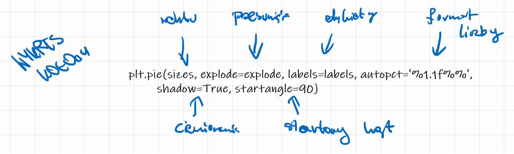

# Matplotlib - pie chart

A pie chart is used when we want to present the proportions of different categories or segments relative to the whole. It is particularly useful when we have a small number of categories (usually no more than 5-7) and when the data is qualitative (categorical). A pie chart allows for a visual understanding of the percentage shares of individual categories within the entire dataset.

Examples of data for which a pie chart is used:

1. The structure of household expenses, where the categories are: housing, food, transport, entertainment, other.
2. The percentage market share of different companies in a given industry.
3. The distribution of votes for political parties in an election.
4. The percentage share of different types of energy in electricity production (coal, gas, renewable energy, nuclear energy, etc.).

Although pie charts have their uses, they are also criticized for limited precision in assessing proportions. Therefore, it is often recommended to use other types of charts, such as bar charts or stacked bar charts, which can be clearer and more precise in comparing values between categories.

The `pie` function is used to create pie charts. It allows for a visual representation of the proportions of different segments relative to the whole. 

The function syntax is `plt.pie(x, explode=None, labels=None, colors=None, autopct=None, shadow=False, startangle=0, counterclock=True)`, where:

- `x` - a list of numeric values, representing the data for each segment. The `pie` function will automatically calculate the percentage shares of each value relative to the sum of all values.
- `explode` - a list of values that determine whether (and how much) each segment is to be separated from the center of the chart. A value of 0 means no separation, and larger values mean greater separation.
- `labels` - a list of strings that will be used as segment labels.
- `colors` - a list of colors for the individual segments.
- `autopct` - the formatting of the percentages to be displayed on the chart (e.g. `'%1.1f%%'`).
- `shadow` - a boolean value (True/False) that determines whether the chart should have a shadow. Set to `False` by default.
- `startangle` - the starting angle of the pie chart, measured in degrees counterclockwise from the X axis.
- `counterclock` - a boolean value (True/False) that determines whether the segments are to be drawn clockwise. Set to `True` by default.



```{python}
#| echo: true
import matplotlib.pyplot as plt

# Data
sizes = [20, 30, 40, 10]
labels = ['Category A', 'Category B', 'Category C', 'Category D']
colors = ['red', 'blue', 'green', 'yellow']
explode = (0, 0.1, 0, 0)  # Highlighting the Category B segment

# Creating the pie chart
plt.pie(sizes, explode=explode, labels=labels, colors=colors, autopct='%1.1f%%', shadow=True, startangle=90)

# Adding a title
plt.title('Pie chart example')

# Equal scaling of the X and Y axes so the circle is round
plt.axis('equal')

plt.show()

```

```{python}
#| echo: true
import matplotlib.pyplot as plt

sizes = [20, 30, 40, 10]
labels = ['Category A', 'Category B', 'Category C', 'Category D']
colors = ['red', 'blue', 'green', 'yellow']
explode = (0, 0.1, 0, 0)

fig, ax = plt.subplots()
ax.pie(sizes, explode=explode, labels=labels, colors=colors, autopct='%1.1f%%', shadow=True, startangle=90)
ax.set_title('Pie chart example')
ax.set_aspect('equal')
plt.show()
```


```{python}
#| echo: true
import matplotlib.pyplot as plt

# Pie chart, where the slices will be ordered and plotted counter-clockwise:
labels = ['Frogs', 'Hogs', 'Dogs', 'Logs']
sizes = [15, 30, 45, 10]
explode = [0, 0.1, 0, 0]  # only "explode" the 2nd slice (i.e. 'Hogs')

plt.pie(sizes, explode=explode, labels=labels, autopct='%1.1f%%',
        shadow=True, startangle=90)
plt.axis('equal')

plt.show()

```

```{python}
#| echo: true
import matplotlib.pyplot as plt

labels = ['Frogs', 'Hogs', 'Dogs', 'Logs']
sizes = [15, 30, 45, 10]
explode = [0, 0.1, 0, 0]

fig, ax = plt.subplots()
ax.pie(sizes, explode=explode, labels=labels, autopct='%1.1f%%', shadow=True, startangle=90)
ax.set_aspect('equal')
plt.show()
```

```{python}
#| echo: true
import matplotlib.pyplot as plt  #<1>
categories = ['Rent', 'Food', 'Transport', 'Entertainment', 'Savings', 'Other']  #<2>
expenses = [1500, 800, 400, 300, 500, 250]  #<3>
colors = ['lightcoral', 'skyblue', 'palegreen', 'khaki', 'plum', 'lightsteelblue']  #<4>
plt.figure(figsize=(10, 8))  #<5>
plt.pie(expenses,
        labels=categories,
        colors=colors,
        autopct='%1.1f%%',
        startangle=90)  #<6>
plt.title('Breakdown of expenses in the household budget', fontsize=16, fontweight='bold')  #<7>
plt.axis('equal')  #<8>
plt.show()  #<9>
```

1. `import matplotlib.pyplot as plt`: imports the matplotlib.pyplot library under the shortened name plt, which allows for convenient use of the functions for creating charts.

2. `categories = ['Rent', 'Food', 'Transport', 'Entertainment', 'Savings', 'Other']`: creates a list of strings representing the categories of household budget expenses.

3. `expenses = [1500, 800, 400, 300, 500, 250]`: creates a list of numbers representing the expense amounts (in zlotys) for each corresponding category.

4. `colors = ['lightcoral', 'skyblue', 'palegreen', 'khaki', 'plum', 'lightsteelblue']`: creates a list of color names that will be used for each slice of the pie chart.

5. `plt.figure(figsize=(10, 8))`: creates a new figure (drawing area) with dimensions of 10 inches wide by 8 inches high.

6. `plt.pie(expenses, labels=categories, colors=colors, autopct='%1.1f%%', startangle=90)`: draws a pie chart with the values from the `expenses` list, labels from the `categories` list, colors from the `colors` list. The `autopct='%1.1f%%'` parameter formats the displayed percentage values to one decimal place and adds a percent sign. The `startangle=90` parameter specifies that the chart will start at an angle of 90 degrees (top).

7. `plt.title('Breakdown of expenses in the household budget', fontsize=16, fontweight='bold')`: adds a title to the chart with a font size of 16 and bold text.

8. `plt.axis('equal')`: sets equal proportions of the X and Y axes, which ensures that the pie chart will be perfectly round rather than elliptical.

9. `plt.show()`: displays the created chart in a graphics window.

```{python}
#| echo: true
import matplotlib.pyplot as plt
categories = ['Rent', 'Food', 'Transport', 'Entertainment', 'Savings', 'Other']
expenses = [1500, 800, 400, 300, 500, 250]
colors = ['lightcoral', 'skyblue', 'palegreen', 'khaki', 'plum', 'lightsteelblue']

fig, ax = plt.subplots(figsize=(10, 8))
ax.pie(expenses,
       labels=categories,
       colors=colors,
       autopct='%1.1f%%',
       startangle=90)
ax.set_title('Breakdown of expenses in the household budget', fontsize=16, fontweight='bold')
ax.set_aspect('equal')
plt.show()
```

Switching to a color map:

```{python}
#| echo: true
import matplotlib.pyplot as plt
import matplotlib.cm as cm  # We add the import of the cm module (color maps)

categories = ['Rent', 'Food', 'Transport', 'Entertainment', 'Savings', 'Other']
expenses = [1500, 800, 400, 300, 500, 250]

# We use the qualitative color map 'Set3'
cmap = plt.colormaps['Set3']
colors = [cmap(i) for i in range(len(categories))]

plt.figure(figsize=(10, 8))
plt.pie(expenses, labels=categories, colors=colors, autopct='%1.1f%%', startangle=90)
plt.title('Breakdown of expenses in the household budget', fontsize=16, fontweight='bold')
plt.axis('equal')
plt.show()
```

```{python}
#| echo: true
import matplotlib.pyplot as plt
import matplotlib.cm as cm  

categories = ['Rent', 'Food', 'Transport', 'Entertainment', 'Savings', 'Other']
expenses = [1500, 800, 400, 300, 500, 250]

cmap = plt.colormaps['Set3']
colors = [cmap(i) for i in range(len(categories))]

fig, ax = plt.subplots(figsize=(10, 8))

ax.pie(expenses, labels=categories, colors=colors, autopct='%1.1f%%', startangle=90)
ax.set_title('Breakdown of expenses in the household budget', fontsize=16, fontweight='bold')
ax.axis('equal')

plt.show()
```

## Donut chart


```{python}
#| echo: true
import matplotlib.pyplot as plt
import numpy as np

np.random.seed(345)  #<1>
data = np.random.randint(20, 100, 6)  #<2>
total = sum(data)  #<3>
data_per = data / total * 100  #<4>
explode = (0.2, 0, 0, 0, 0, 0)  #<5>
plt.pie(data_per, explode=explode, labels=[round(i, 2) for i in list(data_per)])  #<6>
circle = plt.Circle((0, 0), 0.7, color='white')  #<7>
p = plt.gcf()  #<8>
p.gca().add_artist(circle)  #<9>
plt.show()  #<10>
```

1. `np.random.seed(345)`: sets the seed of the random number generator to the value 345, which ensures the reproducibility of the results.

2. `data = np.random.randint(20, 100, 6)`: generates an array of 6 random integers in the range from 20 to 99 (inclusive).

3. `total = sum(data)`: calculates the sum of all the generated numbers.

4. `data_per = data / total * 100`: calculates the percentage values of each number relative to the total sum.

5. `explode = (0.2, 0, 0, 0, 0, 0)`: creates a tuple defining the slice offset for each element (the first slice will be offset by 0.2).

6. `plt.pie(data_per, explode=explode, labels=[round(i, 2) for i in list(data_per)])`: creates a pie chart with the percentage values, with the specified offset and labels rounded to 2 decimal places.

7. `circle = plt.Circle((0, 0), 0.7, color='white')`: creates a white circle centered at the point (0, 0) with a radius of 0.7.

8. `p = plt.gcf()`: gets the current figure object (get current figure).

9. `p.gca().add_artist(circle)`: adds the created white circle to the current chart axes, creating a "donut chart" effect.

10. `plt.show()`: displays the chart.

```{python}
#| echo: true
import matplotlib.pyplot as plt
import numpy as np

np.random.seed(345)
data = np.random.randint(20, 100, 6)
total = sum(data)
data_per = data / total * 100
explode = (0.2, 0, 0, 0, 0, 0)

fig, ax = plt.subplots()
ax.pie(data_per, explode=explode, labels=[round(i, 2) for i in list(data_per)])
circle = plt.Circle((0, 0), 0.7, color='white')
ax.add_artist(circle)
plt.show()
```
