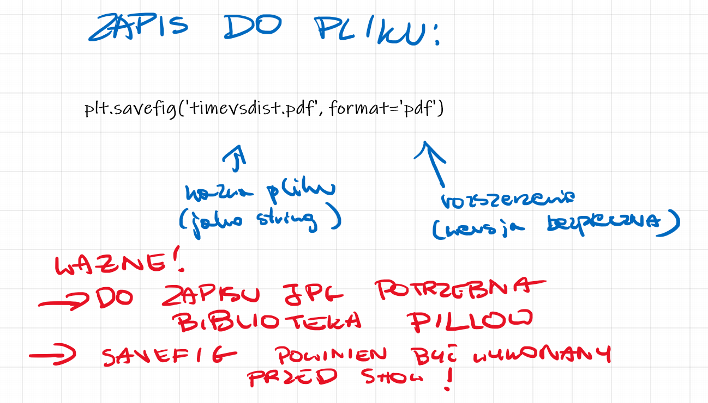

# Matplotlib - saving

1. PNG (Portable Network Graphics) - a raster file, a popular format for saving images on the Internet. 
2. JPEG (Joint Photographic Experts Group) - a raster file, a popular format for saving photographic images. 
3. SVG (Scalable Vector Graphics) - a vector file that scales well and preserves quality across different resolutions. 
4. PDF (Portable Document Format) - a vector document format, popular for printing and viewing documents. 
5. EPS (Encapsulated PostScript) - a vector file, often used in scientific publications and printed materials. 
6. TIFF (Tagged Image File Format) - a raster file, popular in professional printing and graphics. 
7. WebP is a modern image format developed by Google that offers better compression and lower quality loss compared to the popular JPEG and PNG formats, which contributes to faster loading of web pages and savings in data transfer.


```{python}
#| echo: true
import numpy as np
import matplotlib.pyplot as plt

x = np.arange(0, 10)
y = x ^ 2
# Labeling the Axes and Title
plt.title("Graph Drawing")
plt.xlabel("Time")
plt.ylabel("Distance")

# Formatting the line colors
plt.plot(x, y, 'r')

# Formatting the line type
plt.plot(x, y, '>')

# save in pdf formats
plt.savefig('timevsdist.pdf', format='pdf')

```


