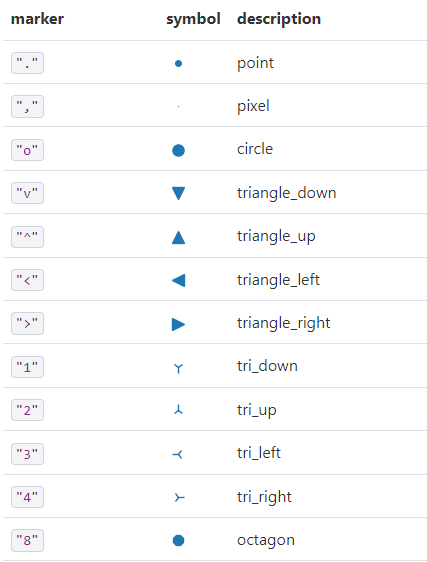
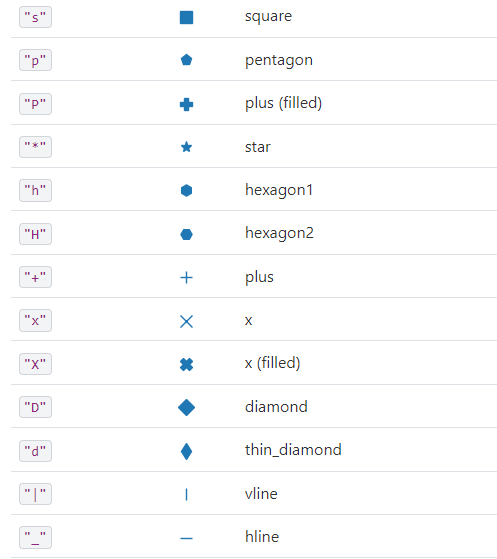
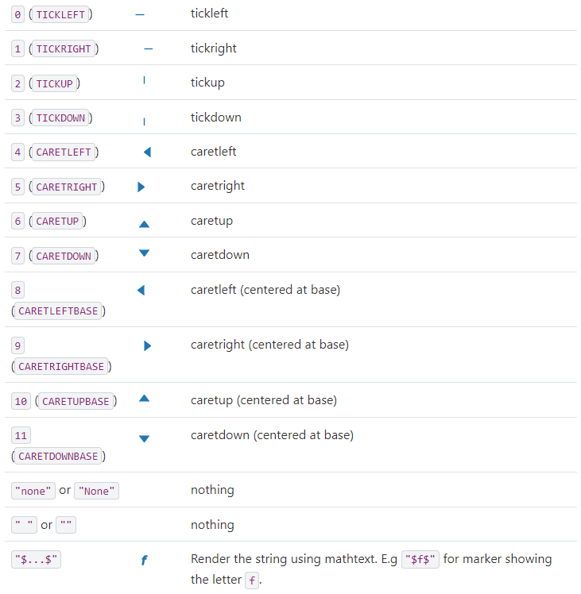

# Matplotlib - scatter plot

A scatter plot is used when we want to present the relationship between two variables or the distribution of data points in a two-dimensional space. A scatter plot is suitable for both continuous and discrete data, when we want to illustrate patterns, correlation, or relationships between variables.

Here are some situations in which scatter plots are used:

1. Analyzing the correlation between two variables, for example the relationship between age and income.
2. Presenting the distribution of data points, for example showing the geographic distribution of stores in a city.
3. Exploring data in order to understand its structure and find patterns, groups, or anomalies, for example to identify data clusters in cluster analysis (clustering).
4. Detecting outliers in the data, for example for detecting unusual observations in a dataset.
5. Comparing different groups or categories of data, for example comparing the economic growth of different countries relative to their public debt.

Scatter plots are particularly useful when dealing with data of a different nature (continuous or discrete) and when we want to investigate correlation, groups, patterns, or outliers.

```{python}
#| echo: true
import matplotlib.pyplot as plt

plt.plot([1, 2, 3, 4], [10, 20, 25, 30], color='lightblue', linewidth=3)  # <1>
plt.scatter([0.3, 3.8, 1.2, 2.5], [11, 25, 9, 26], color='darkgreen', marker='^')  # <2>
plt.xlim(0.5, 4.5)  # <3>
plt.show(block=True)

```

1. `plt.plot([1, 2, 3, 4], [10, 20, 25, 30], color='lightblue', linewidth=3)` - Creates a line chart with the given point coordinates (1, 10), (2, 20), (3, 25) and (4, 30). The line color is light blue (lightblue) and its width is 3.
2. `plt.scatter([0.3, 3.8, 1.2, 2.5], [11, 25, 9, 26], color='darkgreen', marker='^')` - Creates a scatter plot with the given point coordinates (0.3, 11), (3.8, 25), (1.2, 9) and (2.5, 26). - The color of the points is dark green (darkgreen) and their shape is upward-filled triangles (^).
3. `plt.xlim(0.5, 4.5)`    - Sets the range of values on the X axis, starting from 0.5 to 4.5.


```{python}
#| echo: true
import matplotlib.pyplot as plt

fig, ax = plt.subplots()
ax.plot([1, 2, 3, 4], [10, 20, 25, 30], color='lightblue', linewidth=3)
ax.scatter([0.3, 3.8, 1.2, 2.5], [11, 25, 9, 26], color='darkgreen', marker='^')
ax.set_xlim(0.5, 4.5)
plt.show()
```

```{python}
#| echo: true
import matplotlib.pyplot as plt

house_prices = [230000, 350000, 480000, 280000, 420000, 610000, 390000, 580000]
square_meters = [90, 140, 210, 100, 170, 260, 150, 240]
plt.scatter(square_meters, house_prices, color='blue', marker='o')  #<1>
plt.xlabel('Area [m2]')
plt.ylabel('House price [PLN]')
plt.title('Relationship between area and house price')
plt.show(block=True)

```


1. `plt.scatter(square_meters, house_prices, color='blue', marker='o')`: creates a scatter plot with the house areas on the X axis (`square_meters`) and the house prices on the Y axis (`house_prices`). The points are blue (`color='blue'`) and have a circle shape (`marker='o'`).


```{python}
#| echo: true
import matplotlib.pyplot as plt

fig, ax = plt.subplots()
house_prices = [230000, 350000, 480000, 280000, 420000, 610000, 390000, 580000]
square_meters = [90, 140, 210, 100, 170, 260, 150, 240]
ax.scatter(square_meters, house_prices, color='blue', marker='o')
ax.set_xlabel('Area [m2]')
ax.set_ylabel('House price [PLN]')
ax.set_title('Relationship between area and house price')
plt.show()

```

```{python}
#| echo: true
from matplotlib import pyplot as plt

x = [1, -3, 4, 5, 6]
y = [2, 6, -4, 1, 2]
area = [70, 60, 1, 50, 2]
plt.scatter(x, y, marker=">", color="brown", alpha=0.5, s=area)  # <1>
plt.show(block=True)

```

1. The code `plt.scatter(x, y, marker=">", color="brown", alpha=0.5, s=area)` creates a scatter plot.  `x`: a list or array of the x coordinates of the points on the chart. `y`: a list or array of the y coordinates of the points on the chart. The `x` and `y` values must have the same length in order to represent each point on the chart.  `marker`: the symbol representing the shape of the points on the chart. In this case, we use `">"` which means a right-pointing arrow.  `color`: the color of the points on the chart. In this case, we use the color "brown".  `alpha`: the transparency of the points on the chart, where a value of `1` means fully opaque and `0` means fully transparent. In this case, we use a value of `0.5` which means the points are semi-transparent.  `s`: the size of the points on the chart, which can be a single value or a list/array of values with the same length as the `x` and `y` coordinates. 


```{python}
#| echo: true
import pandas as pd
import matplotlib.pyplot as plt


data = {  #<1>
    'product_id': [101, 102, 103, 104, 105, 106, 107, 108, 109, 110],
    'price': [19.99, 29.99, 14.99, 49.99, 9.99, 39.99, 24.99, 34.99, 44.99, 15.99],
    'units_sold': [150, 85, 200, 50, 300, 75, 120, 95, 60, 180],
    'rating': [4.5, 4.2, 4.8, 3.9, 4.6, 4.1, 4.3, 4.0, 3.8, 4.7],
    'discount': [0.1, 0.05, 0.15, 0.0, 0.2, 0.1, 0.05, 0.08, 0.0, 0.12]
}

df = pd.DataFrame(data)  #<2>
x_values = df['price']  #<3>
y_values = df['units_sold']  #<4>
colors = df['rating']  #<5>
sizes = df['discount'] * 1000 + 50  #<6>

plt.scatter(x_values, y_values, s=sizes, c=colors, alpha=0.7, cmap='viridis')  #<7>

plt.colorbar(label='Product rating')  #<8>

plt.xlabel('Product price (PLN)')  #<9>
plt.ylabel('Number of units sold')  #<10>
plt.title('Sales analysis')  #<11>

plt.grid(True, alpha=0.3)  #<12>

plt.show()  #<13>
```

1. `data = {...}`: creates a dictionary containing data about products, where each key corresponds to a column name and the values are lists containing data for 10 products (product id, price, number of units sold, rating, and discount).

2. `df = pd.DataFrame(data)`: converts the `data` dictionary into a pandas DataFrame, which creates an organized data table with named columns.

3. `x_values = df['price']`: extracts the column with product prices and assigns it to the variable `x_values`, which will be used as the X coordinates on the chart.

4. `y_values = df['units_sold']`: extracts the column with the number of units sold and assigns it to the variable `y_values`, which will be used as the Y coordinates on the chart.

5. `colors = df['rating']`: extracts the column with product ratings and assigns it to the variable `colors`, which will be used to assign colors to the points on the chart.

6. `sizes = df['discount'] * 1000 + 50`: creates the variable `sizes` defining the size of the points by multiplying the discount value by 1000 and adding 50, which ensures the visibility of all points (minimum size of 50 units).

7. `plt.scatter(x_values, y_values, s=sizes, c=colors, alpha=0.7, cmap='viridis')`: creates a scatter plot using prices as the X coordinates, sales as Y, point sizes determined by the discounts, colors based on the ratings, with a transparency of 0.7 and the 'viridis' color palette.

8. `plt.colorbar(label='Product rating')`: adds a colorbar to the chart, which shows the scale of product ratings and their corresponding colors.

9. `plt.xlabel('Product price (PLN)')`: sets the X axis label, describing that it shows the product price in zlotys.

10. `plt.ylabel('Number of units sold')`: sets the Y axis label, describing that it shows the number of units sold of the product.

11. `plt.title('Sales analysis')`: gives the chart the title "Sales analysis".

12. `plt.grid(True, alpha=0.3)`: enables the grid on the chart with a transparency of 0.3, which improves the readability of the data.

13. `plt.show()`: displays the prepared chart.

```{python}
#| echo: true
import pandas as pd
import matplotlib.pyplot as plt

data = {
    'product_id': [101, 102, 103, 104, 105, 106, 107, 108, 109, 110],
    'price': [19.99, 29.99, 14.99, 49.99, 9.99, 39.99, 24.99, 34.99, 44.99, 15.99],
    'units_sold': [150, 85, 200, 50, 300, 75, 120, 95, 60, 180],
    'rating': [4.5, 4.2, 4.8, 3.9, 4.6, 4.1, 4.3, 4.0, 3.8, 4.7],
    'discount': [0.1, 0.05, 0.15, 0.0, 0.2, 0.1, 0.05, 0.08, 0.0, 0.12]
}

df = pd.DataFrame(data)
x_values = df['price']
y_values = df['units_sold']
colors = df['rating']
sizes = df['discount'] * 1000 + 50

fig, ax = plt.subplots()
scatter = ax.scatter(x_values, y_values, s=sizes, c=colors, alpha=0.7, cmap='viridis')
cbar = fig.colorbar(scatter, ax=ax)
cbar.set_label('Product rating')

ax.set_xlabel('Product price (PLN)')
ax.set_ylabel('Number of units sold')
ax.set_title('Sales analysis')
ax.grid(True, alpha=0.3)

plt.show()

```

<https://matplotlib.org/stable/api/markers_api.html>








