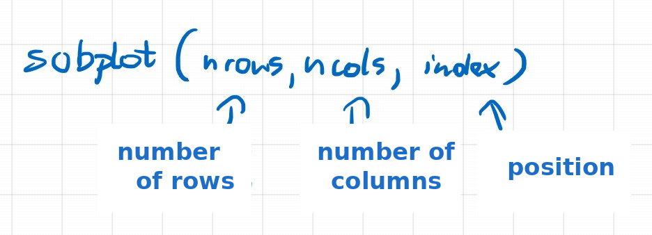

# Matplotlib - subplots



The `subplot` function allows you to create multiple plots within a single window or figure. This makes it possible to compare different plots that share a common context, or to present different aspects of the data.

The function signature is `plt.subplot(nrows, ncols, index, **kwargs)`, where:

- `nrows` - the number of rows in the plot grid.
- `ncols` - the number of columns in the plot grid.
- `index` - the index of the current plot to be created (indexing starts at 1). Indices are numbered row by row, i.e. the next plot in a row will have an index one greater.
- `**kwargs` - additional arguments related to plot formatting.


```{python}
#| echo: true
import matplotlib.pyplot as plt
import numpy as np

x = np.linspace(0, 2 * np.pi, 100)

# Creating a 2x2 grid of plots
# First plot (top-left corner)
plt.subplot(2, 2, 1)
plt.plot(x, np.sin(x))
plt.title('sin(x)')

# Second plot (top-right corner)
plt.subplot(2, 2, 2)
plt.plot(x, np.cos(x))
plt.title('cos(x)')

# Third plot (bottom-left corner)
plt.subplot(2, 2, 3)
plt.plot(x, np.tan(x))
plt.title('tan(x)')

# Fourth plot (bottom-right corner)
plt.subplot(2, 2, 4)
plt.plot(x, -np.sin(x))
plt.title('-sin(x)')

# Adjusting the spacing between plots
plt.tight_layout()

# Displaying the plots
plt.show()

```


```{python}
#| echo: true
import numpy as np
import matplotlib.pyplot as plt

x = np.arange(0, 3, 0.1)
plt.subplot(2, 2, 1)
plt.plot(x, x)
plt.subplot(2, 2, 2)
plt.plot(x, x * 2)
plt.subplot(2, 2, 3)
plt.plot(x, x * x)
plt.subplot(2, 2, 4)
plt.plot(x, x ** 3)
plt.tight_layout()
plt.show()

```


```{python}
#| echo: true
import numpy as np
import matplotlib.pyplot as plt

x = np.arange(0, 3, 0.1)

fig, axes = plt.subplots(2, 2)

axes[0, 0].plot(x, x)
axes[0, 1].plot(x, x * 2)
axes[1, 0].plot(x, x * x)
axes[1, 1].plot(x, x ** 3)

fig.tight_layout()
plt.show()
```


```{python}
#| echo: true
import numpy as np
import matplotlib.pyplot as plt

# Preparing data for visualization
x = np.linspace(0, 10, 100)  # Create 100 points in the range from 0 to 10
y1 = np.sin(x)               # Sine function
y2 = np.cos(x)               # Cosine function
y3 = np.exp(-0.2*x) * np.sin(x)  # Damped sine function
y4 = x**2 / 20               # Quadratic function

# Creating the figure and subplots (2 rows, 2 columns)
# In the procedural approach we use pyplot directly
plt.figure(figsize=(12, 8))  # Set the size of the entire figure (width, height in inches)

# First subplot (top-left)
plt.subplot(2, 2, 1)  # 2 rows, 2 columns, position 1
plt.plot(x, y1, 'r-', linewidth=2)  # Red line
plt.title('Sine function')
plt.xlabel('X')
plt.ylabel('sin(x)')
plt.grid(True)  # Add a grid
plt.axhline(y=0, color='k', linestyle='-', alpha=0.3)  # Horizontal line at y=0

# Second subplot (top-right)
plt.subplot(2, 2, 2)  # 2 rows, 2 columns, position 2
plt.plot(x, y2, 'b-', linewidth=2)  # Blue line
plt.title('Cosine function')
plt.xlabel('X')
plt.ylabel('cos(x)')
plt.grid(True)
plt.axhline(y=0, color='k', linestyle='-', alpha=0.3)

# Third subplot (bottom-left)
plt.subplot(2, 2, 3)  # 2 rows, 2 columns, position 3
plt.plot(x, y3, 'g-', linewidth=2)  # Green line
plt.title('Damped sine')
plt.xlabel('X')
plt.ylabel('exp(-0.2x) * sin(x)')
plt.grid(True)
plt.axhline(y=0, color='k', linestyle='-', alpha=0.3)

# Fourth subplot (bottom-right)
plt.subplot(2, 2, 4)  # 2 rows, 2 columns, position 4
plt.plot(x, y4, 'orange', linewidth=2, linestyle='--', marker='o', markevery=10, markersize=5)
plt.title('Quadratic function')
plt.xlabel('X')
plt.ylabel('x²/20')
plt.grid(True)

# Adding an annotation on the last plot
plt.annotate('Point (5, 1.25)', xy=(5, 1.25), xytext=(6, 1.8),
             arrowprops=dict(facecolor='black', shrink=0.05, width=1.5))

# Adjusting the layout - prevents overlapping
plt.tight_layout()

# Adding an overall title for the whole figure
plt.suptitle('Example of plots with subplots - procedural approach', fontsize=16)
plt.subplots_adjust(top=0.9)  # Add space for the main title

# Displaying the plot
plt.show()
```
