# Pandas - other


## Filling missing values

```{python} 
#| echo: true
import pandas as pd

s = pd.Series([3, -5, 7, 4], index=['a', 'b', 'c', 'd'])
s2 = pd.Series([7, -2, 3], index=['a', 'c', 'd'])
print(s + s2)
print("--")
print(s.add(s2, fill_value=0))
print("--")
print(s.mul(s2, fill_value=2))

```

## Handling missing data

```{python}
#| echo: true
import numpy as np
import pandas as pd

string_data = pd.Series(['aardvark', 'artichoke', np.nan, 'avocado'])
print(string_data)
print(string_data.isna())
print(string_data.dropna())

```

---

```{python}
#| echo: true
from numpy import nan as NA
import pandas as pd

data = pd.DataFrame([[1., 6.5, 3.], [1., NA, NA],
                     [NA, NA, NA], [NA, 6.5, 3.]])
cleaned = data.dropna()
print(cleaned)
print(data.dropna(how='all'))
data[4] = NA
print(data.dropna(how='all', axis=1))
print(data)
print(data.fillna(0))
print(data.fillna({1: 0.5, 2: 0}))
```

## Removing duplicates

```{python} 
#| echo: true
import pandas as pd

data = pd.DataFrame({'k1': ['one', 'two'] * 3 + ['two'],
                     'k2': [1, 1, 2, 3, 3, 4, 4]})
print(data)
print(data.duplicated())
print(data.drop_duplicates())
```

## Replacing values

```{python}
#| echo: true
import pandas as pd
import numpy as np

data = pd.Series([1., -999., 2., -999., -1000., 3.])
print(data)
print(data.replace(-999, np.nan))
print(data.replace([-999, -1000], np.nan))
print(data.replace([-999, -1000], [np.nan, 0]))
print(data.replace({-999: np.nan, -1000: 0}))
```


## Discretization and binning

```{python}
#| echo: true
import pandas as pd

ages = [20, 22, 25, 27, 21, 23, 37, 31, 61, 45, 41, 32]
bins = [18, 25, 35, 60, 100]
cats = pd.cut(ages, bins)
print(cats)
print(cats.codes)
print(cats.categories)
print(pd.Series(cats).value_counts())
```

---

```{python}
#| echo: true
import pandas as pd

ages = [20, 22, 25, 27, 21, 23, 37, 31, 61, 45, 41, 32]
bins = [18, 25, 35, 60, 100]
cats2 = pd.cut(ages, [18, 26, 36, 61, 100], right=False)
print(cats2)
group_names = ['Youth', 'YoungAdult',
               'MiddleAged', 'Senior']
print(pd.cut(ages, bins, labels=group_names))
```

---

```{python}
#| echo: true
import pandas as pd
import numpy as np

data = np.random.rand(20)
print(pd.cut(data, 4, precision=2))
```

---

```{python}
#| echo: true
import pandas as pd
import numpy as np

data = np.random.randn(1000)
cats = pd.qcut(data, 4)
print(cats)
print(pd.Series(cats).value_counts())
```

## Detecting and filtering outliers

```{python}
#| echo: true
import pandas as pd
import numpy as np

data = pd.DataFrame(np.random.randn(1000, 4))
print(data.describe())
print("---")
col = data[2]
print(col[np.abs(col) > 3])
print("---")
print(data[(np.abs(data) > 3).any(axis=1)])
```

## Changing the column type

```{python}
#| echo: true
import pandas as pd


data = {
    'A': ['1', '2', '3', '4', '5', '6'],
    'B': ['7.5', '8.5', '9.5', '10.5', '11.5', '12.5'],
    'C': ['x', 'y', 'z', 'x', 'y', 'z']
}
data2 = pd.DataFrame(data)

# Display the original DataFrame
print("Original DataFrame:")
print(data2)

# Change the data type of column 'A' to int
data2['A'] = pd.Series(data2['A'], dtype=int)

# Change the data type of column 'B' to float
data2['B'] = pd.Series(data2['A'], dtype=float)

# Display the DataFrame after type changes
print("\nDataFrame after type changes:")
print(data2)

```


```{python}
#| echo: true
import pandas as pd


data = {
    'A': ['1', '2', '3', '4', '5', '6'],
    'B': ['7.5', '8.5', '9.5', '10.5', '11.5', '12.5'],
    'C': ['x', 'y', 'z', 'x', 'y', 'z']
}
data2 = pd.DataFrame(data)

# Display the original DataFrame
print("Original DataFrame:")
print(data2)

# Change the data type of column 'A' to int
data2['A'] = data2['A'].astype(int)

# Change the data type of column 'B' to float
data2['B'] = data2['B'].astype(float)

# Display the DataFrame after type changes
print("\nDataFrame after type changes:")
print(data2)

```

## Changing characters in categories

```{python}
#| echo: true
import pandas as pd

# Creating a DataFrame
data = {
    'A': ['abc', 'def', 'ghi', 'jkl', 'mno', 'pqr'],
    'B': ['1.23', '4.56', '7.89', '0.12', '3.45', '6.78'],
    'C': ['xyz', 'uvw', 'rst', 'opq', 'lmn', 'ijk']
}
data2 = pd.DataFrame(data)

# Display the original DataFrame
print("Original DataFrame:")
print(data2)

# Change lowercase letters to uppercase in column 'A'
data2['A'] = data2['A'].str.upper()

# Replace the dot with a comma in column 'B'
data2['B'] = data2['B'].str.replace('.', ',')

# Display the DataFrame after modification
print("\nDataFrame after modification:")
print(data2)

```


## Manipulation operations

Cheat sheet <https://pandas.pydata.org/Pandas_Cheat_Sheet.pdf>

* `merge`

<https://pandas.pydata.org/docs/reference/api/pandas.DataFrame.merge.html>

The `merge` function is used to combine two DataFrames along a common column, similar to JOIN operations in SQL.

```python
DataFrame.merge(right, how='inner', on=None, left_on=None, right_on=None,
                left_index=False, right_index=False, sort=False,
                suffixes=('_x', '_y'), copy=True, indicator=False, validate=None)
```

Where:

- `right`: the DataFrame you want to join with the original DataFrame.
- `how`: specifies the type of join. Four types are available: 'inner', 'outer', 'left', and 'right'. 'inner' is the default value, which returns only those rows that have matching keys in both DataFrames.
- `on`: the name or list of names to be used for joining. This must be a name that occurs in both the original and the right DataFrame.
- `left_on` and `right_on`: names of columns in the left and right DataFrames to be used for joining. This can be used if the column names are not the same.
- `left_index` and `right_index`: whether indexes from the left and right DataFrames should be used for joining.
- `sort`: whether the resulting DataFrame should be sorted by the join keys.
- `suffixes`: suffixes to be added to the names of overlapping columns. The default is ('_x', '_y').
- `copy`: whether to always copy the data, even when not necessary.
- `indicator`: adds a column to the resulting DataFrame that shows the source of each row.
- `validate`: checks whether specified join rules are met.


```{python}
#| echo: true
import pandas as pd

df1 = pd.DataFrame({
    'A': ['A0', 'A1', 'A2', 'A3'],
    'B': ['B0', 'B1', 'B2', 'B3'],
    'key': ['K0', 'K1', 'K0', 'K1']
})

df2 = pd.DataFrame({
    'C': ['C0', 'C1'],
    'D': ['D0', 'D1']},
    index=['K0', 'K1']
)

print(df1)
print(df2)
merged_df = df1.merge(df2, left_on='key', right_index=True)
print(merged_df)
```

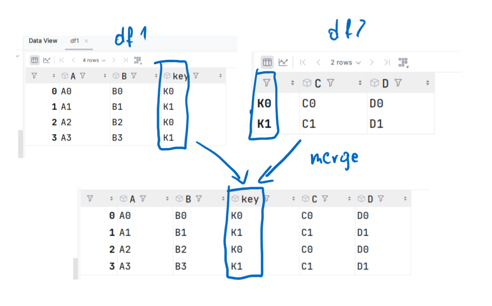

```{python}
#| echo: true
import pandas as pd

df1 = pd.DataFrame({
    'key': ['K0', 'K1', 'K2', 'K3'],
    'A': ['A0', 'A1', 'A2', 'A3'],
    'B': ['B0', 'B1', 'B2', 'B3']
})

df2 = pd.DataFrame({
    'key': ['K0', 'K1', 'K4', 'K5'],
    'C': ['C0', 'C1', 'C2', 'C3'],
    'D': ['D0', 'D1', 'D2', 'D3']
})

print(df1)

print(df2)

inner_merged_df = df1.merge(df2, how='inner', on='key', suffixes=('_left', '_right'),
                            indicator=True)
outer_merged_df = df1.merge(df2, how='outer', on='key', suffixes=('_left', '_right'),
                            indicator=True)
left_merged_df = df1.merge(df2, how='left', on='key', suffixes=('_left', '_right'),
                           indicator=True)
right_merged_df = df1.merge(df2, how='right', on='key', suffixes=('_left', '_right'),
                            indicator=True)

print("Inner join")
print(inner_merged_df)

print("Outer join")
print(outer_merged_df)

print("Left join")
print(left_merged_df)

print("Right join")
print(right_merged_df)
```

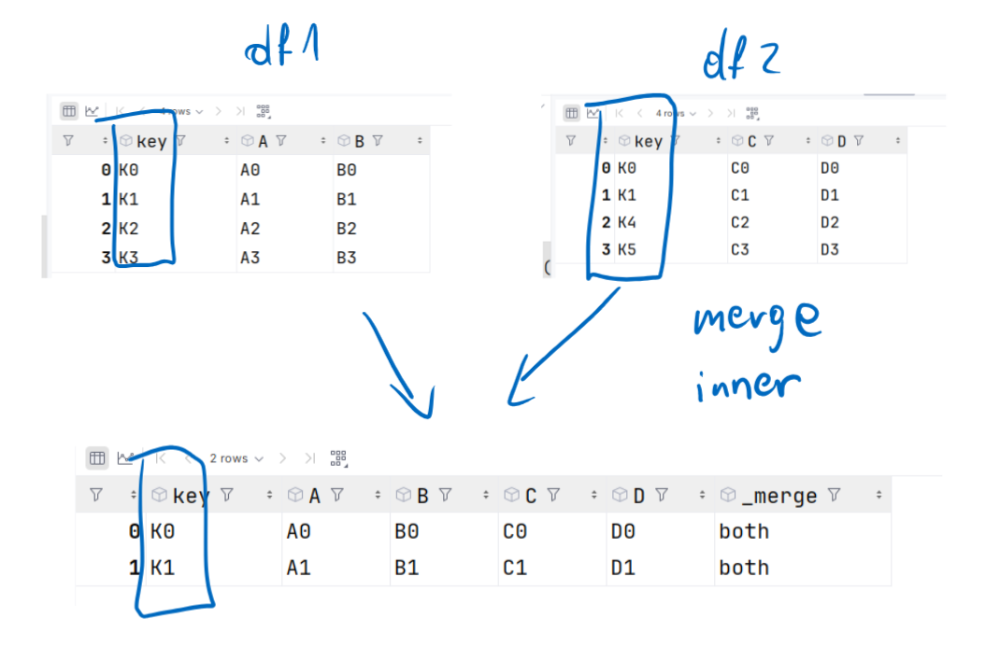

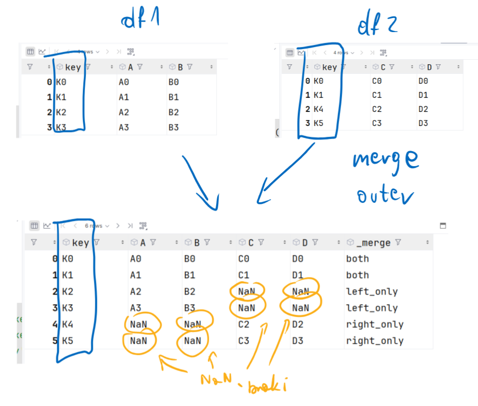

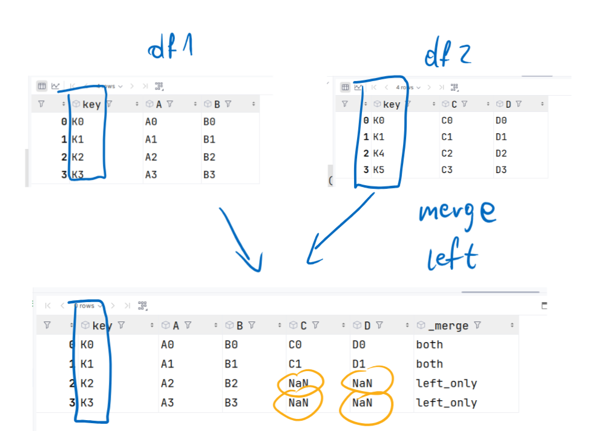

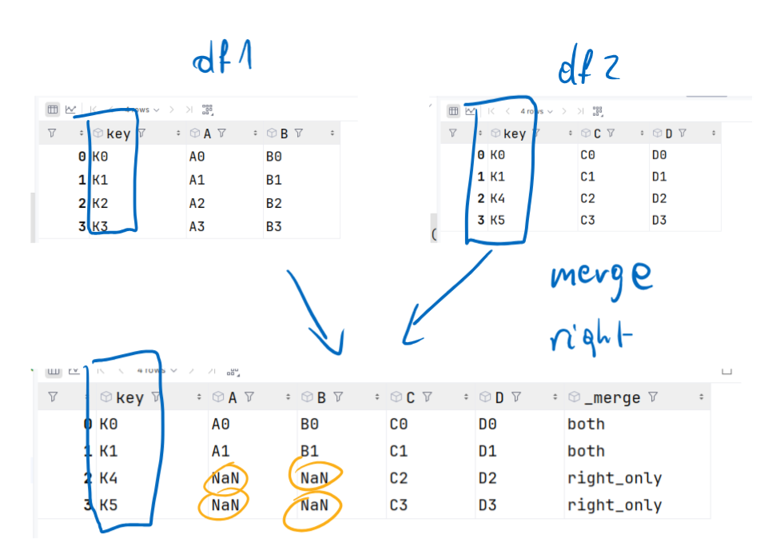

* `join`

<https://pandas.pydata.org/docs/reference/api/pandas.DataFrame.join.html>

The `join` method is used to combine two DataFrames along an axis.

The basic usage of this method looks as follows:

```python
DataFrame.join(other, on=None, how='left', lsuffix='', rsuffix='', sort=False)
```

Where:

- `other`: the DataFrame you want to join with the original DataFrame.
- `on`: the name or list of names of columns in the original DataFrame on which you want to join.
- `how`: specifies the type of join. Four types are available: 'inner', 'outer', 'left', and 'right'. 'left' is the default value, which returns all rows from the original DataFrame and matching rows from the second DataFrame. Values are filled with NaN if there is no match.
- `lsuffix` and `rsuffix`: suffixes to be added to repeating columns. The default is empty.
- `sort`: whether to sort the data by the key.


```{python}
#| echo: true
import pandas as pd

df1 = pd.DataFrame({
    'A': ['A0', 'A1', 'A2'],
    'B': ['B0', 'B1', 'B2']},
    index=['K0', 'K1', 'K2']
)

df2 = pd.DataFrame({
    'C': ['C0', 'C2', 'C3'],
    'D': ['D0', 'D2', 'D3']},
    index=['K0', 'K2', 'K3']
)

print(df1)

print(df2)

joined_df = df1.join(df2)
print(joined_df)
```

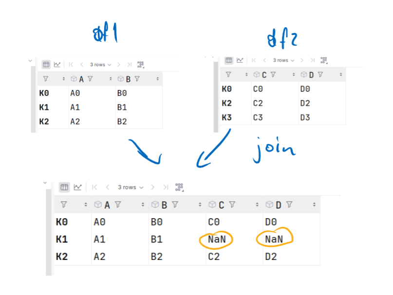

* `concat`

<https://pandas.pydata.org/docs/reference/api/pandas.concat.html>

The `concat` method is used to combine two or more DataFrames along a specified axis.

The basic usage of this method looks as follows:

```python
pandas.concat(objs, axis=0, join='outer', ignore_index=False, keys=None,
              levels=None, names=None, verify_integrity=False, sort=False,
              copy=True)
```

Where:

- `objs`: a sequence of DataFrames you want to combine.
- `axis`: the axis along which you want to combine the DataFrames. The default is 0 (combining rows, vertically), but it can also be set to 1 (combining columns, horizontally).
- `join`: specifies the type of join. Two types are available: 'outer' and 'inner'. 'outer' is the default value, which returns all columns from each DataFrame. 'inner' returns only those columns that are common to all DataFrames.
- `ignore_index`: if set to True, does not use the indexes from the DataFrames to create the index in the resulting DataFrame. Instead, it creates a new index from 0 to n-1.
- `keys`: values to associate with the objects.
- `levels`: specified indexes for the new DataFrame.
- `names`: names for the index levels (if multilevel).
- `verify_integrity`: checks whether the new, concatenated DataFrame does not have duplicate indexes.
- `sort`: whether to sort the non-concatenation axis (e.g., indexes if axis=0), regardless of the data.
- `copy`: whether to always copy the data, even when not necessary.


```{python}
#| echo: true
import pandas as pd

df1 = pd.DataFrame({
    'A': ['A0', 'A1', 'A2'],
    'B': ['B0', 'B1', 'B2']
})

df2 = pd.DataFrame({
    'A': ['A3', 'A4', 'A5'],
    'B': ['B3', 'B4', 'B5']
})

print(df1)

print(df2)

concatenated_df = pd.concat([df1, df2], ignore_index=True)
print(concatenated_df)
```

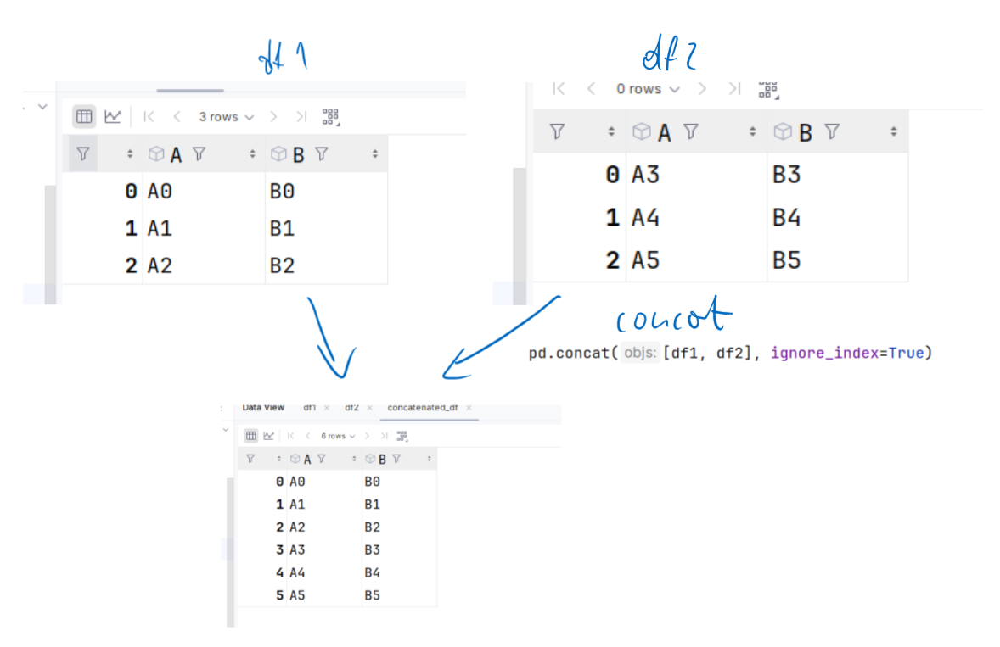

```{python}
#| echo: true
import pandas as pd

df1 = pd.DataFrame({
    'A': ['A0', 'A1', 'A2'],
    'B': ['B0', 'B1', 'B2']
})

df2 = pd.DataFrame({
    'C': ['C0', 'C1', 'C2'],
    'D': ['D0', 'D1', 'D2']
})

print(df1)

print(df2)

concatenated_df_axis1 = pd.concat([df1, df2], axis=1)
concatenated_df_keys = pd.concat([df1, df2], keys=['df1', 'df2'])

print(concatenated_df_axis1)
print(concatenated_df_keys)

```

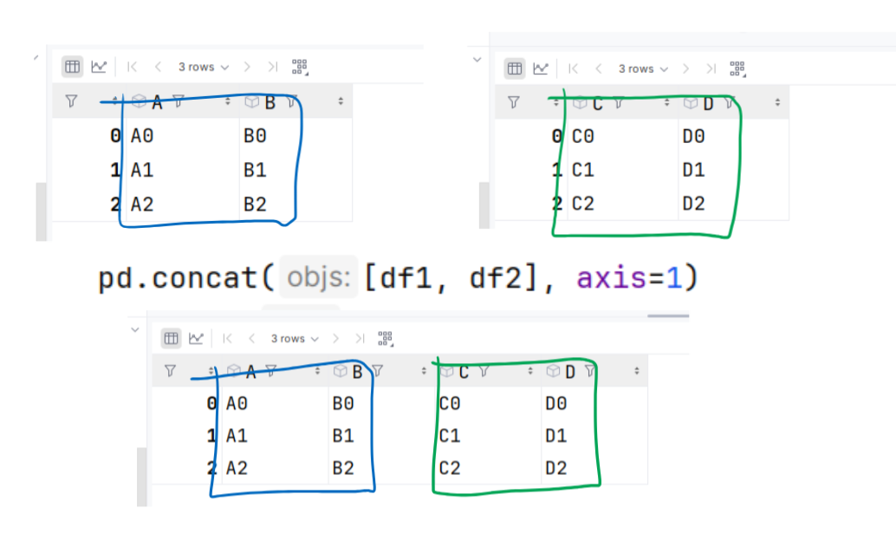

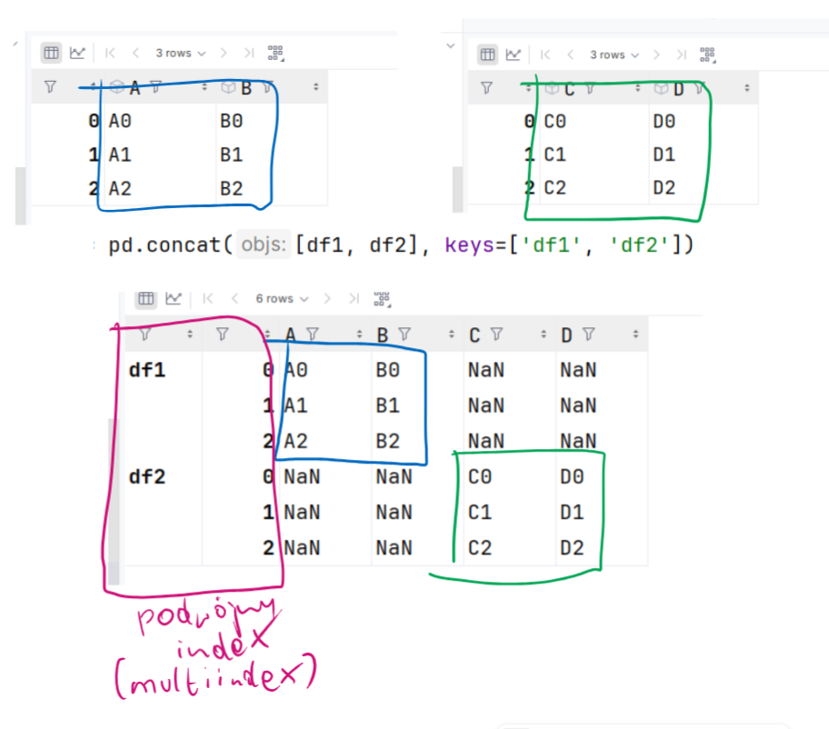

* `pivot`

<https://pandas.pydata.org/docs/reference/api/pandas.DataFrame.pivot.html>


The `pivot` method is used to transform data from a "long" format into a "wide" format.

The basic usage of this method looks as follows:

```python
DataFrame.pivot(index=None, columns=None, values=None)
```

Where:

- `index`: the name of a column or a list of column names that are to become the index in the new DataFrame.
- `columns`: the name of a column whose unique values are to become columns in the new DataFrame.
- `values`: the name of a column or a list of column names that are to become the values for the new columns in the new DataFrame.


```{python}
#| echo: true
import pandas as pd

df = pd.DataFrame({
    'foo': ['one', 'one', 'one', 'two', 'two', 'two'],
    'bar': ['A', 'B', 'C', 'A', 'B', 'C'],
    'baz': [1, 2, 3, 4, 5, 6],
    'zoo': ['x', 'y', 'z', 'q', 'w', 't'],
})

print(df)

pivot_df = df.pivot(index='foo', columns='bar', values='baz')
print(pivot_df)
```

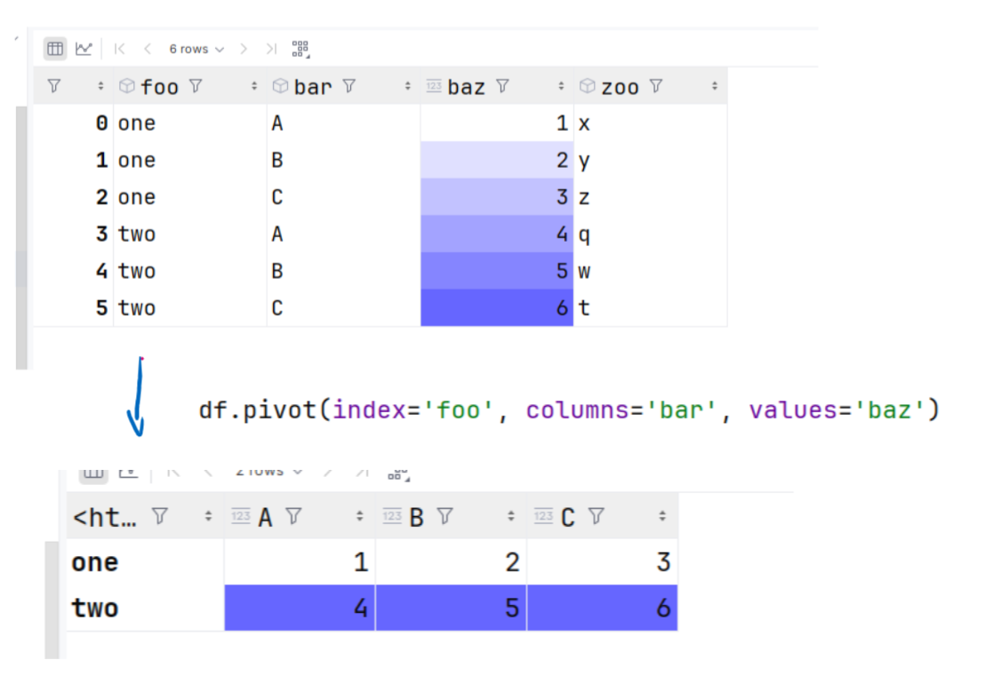

* `wide_to_long`

<https://pandas.pydata.org/docs/reference/api/pandas.wide_to_long.html>


The `wide_to_long` method is used to transform data from a wide format (where each column contains multiple variables) into a long format (where each column contains a single variable with multiple measurements). This is useful when we have data spread across many columns with repeating or sequential names, and we want to transform this data in a way that facilitates analysis and visualization.

Explanation of the `wide_to_long` parameters

- **stubnames**: A list of the initial parts of column names that are to be transformed.
- **i**: The name of a column or list of columns that identify individual rows. In our example, this is `id`, which uniquely identifies a person.
- **j**: The name of the new column where the various levels of variables will be stored (in our case, year).
- **sep**: Optional separator (default `""`).

```{python}
#| echo: true
import pandas as pd

# Sample data
data = {
    'id': ['A', 'B', 'C'],
    'height_2020': [180, 175, 165],
    'weight_2020': [70, 76, 65],
    'height_2021': [181, 176, 166],
    'weight_2021': [71, 77, 66]
}

data2 = pd.DataFrame(data)

# Transformation to long format
df_long = pd.wide_to_long(data2, stubnames=['height', 'weight'], i='id', j='year', sep='_')
df_long = df_long.reset_index()

print(df_long)

```

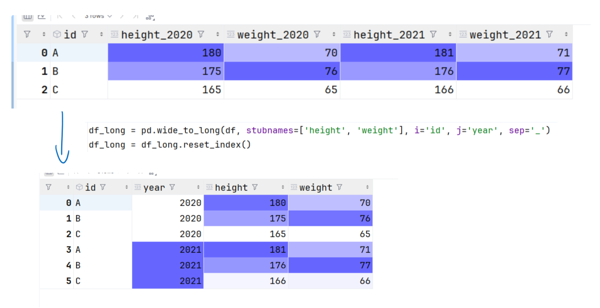

* `melt`


<https://pandas.pydata.org/docs/reference/api/pandas.DataFrame.melt.html>


The `melt` function is used to transform data from a wide format into a long format.

The basic usage of this method looks as follows:

```python
pandas.melt(frame, id_vars=None, value_vars=None, var_name=None, value_name='value', col_level=None)
```

Where:

- `frame`: the DataFrame you want to process.
- `id_vars`: the column(s) you want to keep as identifiers. These columns will not be changed.
- `value_vars`: the column(s) you want to transform into key-value pairs. If not provided, all columns that are not `id_vars` will be used.
- `var_name`: the name of the new column that will contain the names of the columns transformed into key-value pairs. The default is 'variable'.
- `value_name`: the name of the new column that will contain the values of the columns transformed into key-value pairs. The default is 'value'.
- `col_level`: if the columns are multilevel, this is the level that will be used to transform the columns into key-value pairs.


```{python}
#| echo: true
import pandas as pd

data = pd.DataFrame({
    'A': ['foo', 'bar', 'baz'],
    'B': ['one', 'one', 'two'],
    'C': [2.0, 1.0, 3.0],
    'D': [3.0, 2.0, 1.0]
})
print(data)
melted_df = data.melt(id_vars=['A', 'B'], value_vars=['C', 'D'], var_name='My_Var',
                      value_name='My_Val')
print(melted_df)

```

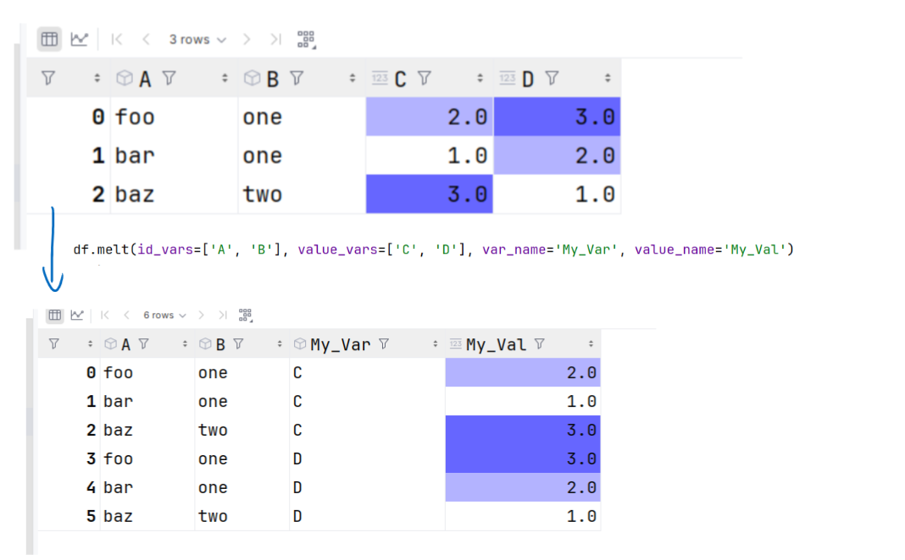


