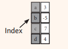
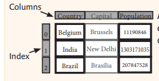

# Pandas - getting started


Pandas is a Python library used for data analysis and manipulation


## Import:

```python
import pandas as pd
```


## Basic objects

Series



---

DataFrame




```{python}
#| echo: true
import pandas as pd

s = pd.Series([3, -5, 7, 4])
print(s)
print("values")
print(s.to_numpy())
print(type(s.to_numpy()))
print(s.index)
print(type(s.index))

```


```{python}
#| echo: true
import pandas as pd
import numpy as np

s = pd.Series([3, -5, 7, 4], index=['a', 'b', 'c', 'd'])
print(s)
print(s['b'])
s['b'] = 8
print(s)
print(s[s > 5])
print(s * 2)
print(np.sin(s))

```


```{python} 
#| echo: true
import pandas as pd

d = {'key1': 350, 'key2': 700, 'key3': 70}
s = pd.Series(d)
print(s)

```


```{python} 
#| echo: true
import pandas as pd

d = {'key1': 350, 'key2': 700, 'key3': 70}
k = ['key0', 'key2', 'key3', 'key1']
s = pd.Series(d, index=k)
print(s)
s.name = "Value"
s.index.name = "Key"
print(s)

```


```{python} 
#| echo: true
import pandas as pd

data = {'Country': ['Belgium', 'India', 'Brazil'],
        'Capital': ['Brussels', 'New Delhi', 'Brasília'],
        'Population': [11190846, 1303171035, 207847528]}
frame = pd.DataFrame(data)
print(frame)
data2 = pd.DataFrame(data, columns=['Country', 'Population', 'Capital'])
print(data2)

```


```{python} 
#| echo: true
import pandas as pd

data = {'Country': ['Belgium', 'India', 'Brazil'],
        'Capital': ['Brussels', 'New Delhi', 'Brasília'],
        'Population': [11190846, 1303171035, 207847528]}
df_data = pd.DataFrame(data, columns=['Country', 'Population', 'Capital'])
print("Shape:", df_data.shape)
print("--")
print("Index:", df_data.index)
print("--")
print("columns:", df_data.columns)
print("--")
df_data.info()
print("--")
print(df_data.count())

```
